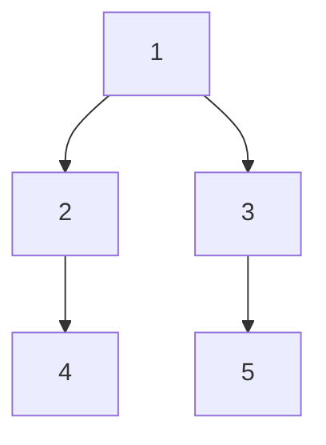

> 题目链接：https://ac.nowcoder.com/acm/contest/58860
>
> 来源：牛客网

## 题目描述

> 统计树上所有的非空点集 $S$ 其最近公共祖先结点的权值 $a_{\mathrm{LCA}(S)}$ , 如果为 $|S|$ 为偶数则加，否则减。
>
> $\sum\limits_{S\subset U} a_{\mathrm{LCA}(S)}\cdot (-1)^{|S|}$

我们考虑计算以 $u$ 为 LCA 的非空点集个数。

以 $u$ 为根节点时，其非空点集共有 $2^{s_{u}+1} - 1$ 种。

而这些点集中，只从其中的一棵子树里选择的点集，他们的 LCA 是 $u$ 的子节点 $v_{i}$ 。

这些点集总共有 $\sum\limits_{v\in G[u]} (2^{s_{v}+1}-1)$ 个。

所以以 $u$ 为 LCA 的非空点集个数为 $(2^{s_{u}+1} - 1)-\sum\limits_{v\in G[u]} (2^{s_{v}+1}-1)$

在下面这个图中，以 $1$ 为根节点时，其非空点集有

```
1 2 3 4 5
12 13 14 15 23 24 25 34 35 45
123 124 125 134 135 145 234 235 245 345
1234 1235 1245 1345 2345
12345
```

以 $2$ 或 $3$ 为根节点时，其非空点集有

```
2 4
24
3 5
35
```

这些点集以 $2$ 或 $3$ 为 LCA， 需要在上面减掉。



由二项式定理得：

 $(2^{n} - 1)$ 个总贡献 $=-\dbinom{n}{0}+\dbinom{n}{1}-\dbinom{n}{2}+\cdots \pm\dbinom{n}{n}+\dbinom{n}{0}=+\dbinom{n}{0}=1$ 

这是因为 $n$ 的所有组合中，选奇数个的和选偶数个的集合数相同。

所以，以 $u$ 为 LCA 的点集总贡献为 $1-\sum\limits_{v\in G[u]} 1=1-G[u].size$

计算每个结点的贡献 $\sum\limits_{u\in G} a_{i}\cdot (1-G[u].size)$ 

```cpp
#include <bits/stdc++.h>
using namespace std;
using i64 = long long;
const int N = 2e5 + 5;
int read(int x = 0) { return cin >> x, x; }

int n;
int s[N];

int main() {
    n = read();
    for (int i = 2; i <= n; i++)
        s[read()]++;
    i64 ans = 0;
    for (int i = 1; i <= n; i++)
        ans += read() * (1 - s[i]);
    cout << ans << endl;
}
```

