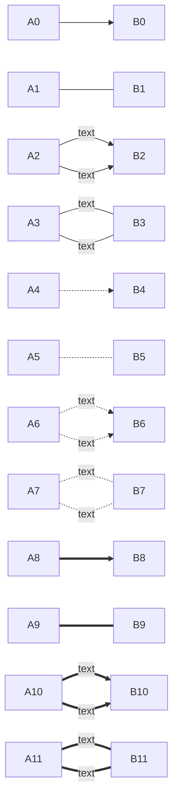

<!-- 六种标题 -->

# 一

## 二

### 三

#### 四

##### 五

###### 六

==高亮==

*斜体文本*
_斜体文本_
**粗体文本**
__粗体文本__
***粗斜体文本***
___粗斜体文本___
~~删除线~~

 `<u>`下划线 `</u>`

<!-- 分界线 -->

---

---

---

---

---

---

创建脚注格式 [^注释]。

* 第一项
* 第二项
* 第三项

+ 第一项
+ 第二项
+ 第三项

- 第一项
- 第二项
- 第三项

1. 第一项
2. 第二项
3. 第三项
4. 第一项：
   - 第一项嵌套的第一个元素
   - 第一项嵌套的第二个元素
5. 第二项：
   - 第二项嵌套的第一个元素
   - 第二项嵌套的第二个元素

> 最外层
>
>> 第一层嵌套
>>
>>> 第二层嵌套
>>>
>>

> 区块中使用列表
>
> 1. 第一项
> 2. 第二项
>
> + 第一项
> + 第二项
> + 第三项

* 第一项
  > 列表中使用区块
  >
* 第二项

<!-- 行内代码 -->

`printf()` 函数

<!-- 代码块 -->

```cpp{.line-numbers}
#include <iostream>
int main()
{
    std::cout << "Hello World";
    return 0;
}
```

<!-- 链接(网页链接) -->

[VScode](https://code.visualstudio.com/)
[https://code.visualstudio.com/](https://code.visualstudio.com/)

这个链接用 google 作为网址变量 [Google][google]
这个链接用 vscode 作为网址变量 [VScode][vscode]
然后在文档的结尾为变量赋值（网址）

  [google]: http://www.google.com/
  [vscode]: https://code.visualstudio.com/

<!-- 文件链接 -->

[文件](./0.cpp)

<!-- 图片插入(网站或本地) -->


| 表头   | 表头   |
| ------ | ------ |
| 单元格 | 单元格 |
| 单元格 | 单元格 |

使用 `<kbd>`Ctrl`</kbd>`+`<kbd>`shift`</kbd>`+`<kbd>`Esc`</kbd>` 打开任务管理器

<!-- 行latex数学公式 -->

$\lim\limits_{x \to 0} \dfrac{\sin x}{x} = 1$

<!-- latex数学公式块 -->

$$
\lim_{n\to\infty} (1+\frac{1}{n})^n = e
$$

[点这里进入在线Latex公式编辑器](https://latexlive.com/)

<!-- 图表 -->

### `mermaid`图表

[mermaid](https://mermaid-js.github.io)

#### `flowchart` `graph`流程图

##### 方向：

* `TB`上下
* `BT`下上
* `LR`左右
* `RL`右左

##### 元素的形状定义：


##### 线条定义：



### `flow`流程图

##### 定义模块 `id=>关键字: 描述`

##### 关键字：

* `start` 流程开始，以圆角矩形绘制
* `opearation` 操作，以直角矩形绘制
* `condition` 判断，以菱形绘制
* `subroutine` 子流程，以左右带空白框的矩形绘制
* `inputoutput` 输入输出，以平行四边形绘制
* `end` 流程结束，以圆角矩形绘制

##### 定义模块间的流向:

* `模块1 id->模块2 id` 一般的箭头指向
* `条件模块id (描述)->模块id(direction)` 条件模块跳转到对应的执行模块，并指定对应分支的布局方向

```flow
st=>start: 开始
ipt=>inputoutput: 输入一个x
op=>operation: 处理加工x+1
cond=>condition: 溢出（是或否？）
sub=>subroutine: 子流程
io=>inputoutput: 输出x
ed=>end: 结束

st->ipt->op->cond
cond(yes)->io->ed
cond(no)->sub->io->ed
```

[^注释]: 这是注释
