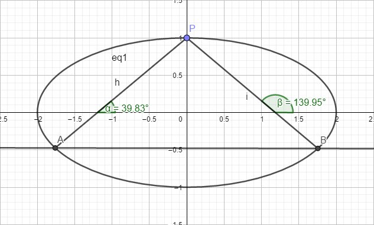

## 椭圆共点定角弦所得直线性质再探究

>已知P($x_0,y_0$)为椭圆 $ \frac{x^2}{a^2}+\frac{y^2}{b^2}=1 $ 上一点，PA、PB为椭圆的两条动弦，其倾斜角分别为ɑ、β，且**ɑ-β=θ**，θ∈[0,2π)。试探究直线AB的性质。  



大量具有精准良好的计算结果均表明：
1. **当θ = 0时，直线AB为椭圆的上各个点的切线**
2. **当θ∈(0,π/2)∪(π/2,π)时，直线AB为椭圆内部某小椭圆上各个点的切线**
3. **当θ = π/2时，直线AB恒过定点**

以下为证明过程
（数学手算证明，C++程序辅助计算）

$ 设直线AB：y=kx + m ，A(x_1 , y_1),B(x_2, y_2)，PA、PB斜率为k_1 = tanα 、k_2 = tanβ ，直线AB恒过定点Q $

联立$ \Biggr\{ 
  \begin{array}{l}
            \frac{x^2}{a^2}+\frac{y^2}{b^2}=1 \\ y=kx + m
  \end{array} $ 得 ： $ (a^2k^2 + b^2)x^2 + 2a^2kmx + a^2(m^2 - b^2) = 0 $

* >>$ x_1 + x_2 = \frac {-2a^2km}{a^2k^2 + b^2} $  **(1)**
* >>$ x_1x_2 = \frac {a^2(m^2 - b^2)}{a^2k^2 + b^2} $  **(2)**
* >>$ y_1 + y_2 = k(x_1 + x_2) +2m = \frac {2b^2m}{a^2k^2 + b^2} $  **(3)**
* >>$ y_1y_2 = (kx_1 + m)(kx_2 +m) = \frac {b^2(m^2 - a^2k^2)}{a^2k^2 + b^2} $  **(4)**

因为 $ k_1 = \frac {y_1 - y_0}{x_1 - x_0} , k_2 = \frac {y_2 - y_0}{x_2 - x_0}$
所以
* $ k_1 \cdot k_2 = \frac {(y_1 - y_0)(y_2 - y_0)}{(x_1 - x_0)(x_2 - x_0)}
                = \frac {y_1y_2 - y_0(y_1 + y_2) + y_0^2}{x_1x_2 - x_0(x_1 + x_2) + x_0^2} $ **(*)** 

### 当$ θ = \frac {π}{2} $ 时

因为 α  = θ + β     所以 $ tanα = tan(θ + β) = \frac {sin(θ + β)}{cos(θ + β)} = \frac {cosβ}{-sinβ} = - \frac {1}{tanβ} $

即：$ tanα \cdot tanβ + 1 = 0 $

>>即：$ k_1 k_2 - 1 = 0 $

把(**)代入式得
>>$ y_1y_2 - y_0(y_1 + y_2) + y_0^2 + x_1x_2 - x_0(x_1 + x_2) + x_0^2 = 0 $

把$ (1)(2)(3)(4) $代入得
>>$ b^2(m^2 - a^2k^2) - y_0(2b^2m) + a^2(m^2 - b^2) - x_0(-2a^2km) +(y_0^2 + x_0^2)(a^2k^2 + b^2) = 0 $

整理得
>>$ (a^2 + b^2)m^2 + 2(a^2x_0k - b^2y_0)m + a^2(-b^2 + x_0^2 + y_0^2)k^2 + b^2(-a^2 + x_0^2 + y_0^2) = 0 $

代入$a^2y^2+b^2x^2=a^2b^2$得
>>$ (a^2 + b^2)m^2 + 2(a^2x_0k - b^2y_0)m + x^2(a^2 - b^2)k^2 - y^2(a^2 - b^2) = 0 $

```c++
//代码如下
A = a2 + b2;
B = 2 * a2 * x0;
C = -2 * b2 * y0;
D = x0 * x0 * (a2 - b2);
E = 0;
F = -y0 * y0 * (a2 - b2);
```

**所以 若使直线PA、PB倾斜角α - β = θ ，直线AB恒过定点，$ m $ 与 $ k $应满足：**
>> **$ f(k,m) = Am^2 + (Bk + C)m + Dk^2 + Ek + F=0  $**

设$ k，m $的值域分别为集合$ K，M $的子集

>>**所以${\forall} k_0 ∈ K $ ，都${\exists} m_0 ∈ M $ ，使$ f(k_0,m_0) = 0 $成立 ==> 直线PA、PB倾斜角α - β = θ ==> 直线：$ y = k_0x + m_0 $ 过所求定点Q**

若要求Q点的坐标，我们可以**朝着目标来**。
不妨令$k_1 = 0 ，k_2 = 1 $  则$ f(0,m_1) = 0 ， f(1,m_2) = 0 $
即
+ $ Am_1^2 + Cm_1 + F = 0 $ 解得：$ m_{11} ， m_{12}  $
经检验的直线 $ y = m_{12} $ 过P $ (x_0,y_0) $，则舍去$ m_{12} $
+ $ Am_2^2 + (B + C)m_2 + D + E + F = 0 $ 解得：$ m_{21} ， m_{22}  $
经检验的直线 $ y = x + m_{22} $ 过P $ (x_0,y_0) $，则舍去$ m_{22} $

**若两条相交的直线都经过同一点，则该点为这两条直线的交点。**

**所以 直线$ y = m_{11} $ 与 直线$ y = x + m_{21} $的交点即为所求定点Q**
**解得：$ Q(m_{11} - m_{21} , m_{11}) $**
```c++
//代码如下
double x1, x2, m1, m2;
solve_equation(A, C, F, &m1, &m2);
x1 = (abs(m1 - y0) > abs(m2 - y0)) ? m1 : m2;
solve_equation(A, B + C, D + E + F, &m1, &m2);
x2 = (abs(x0 + m1 - y0) > abs(x0 + m2 - y0)) ? m1 : m2;
printf("直线AB恒过定点Q(%f,%f)\n", x1 - x2, x1);        
```
证毕