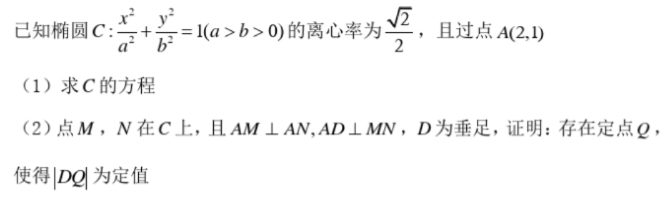
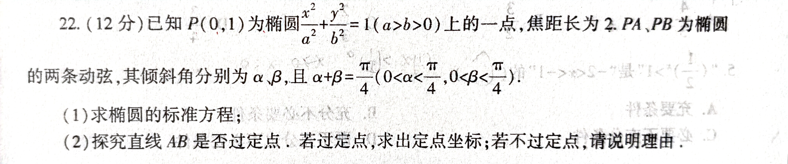
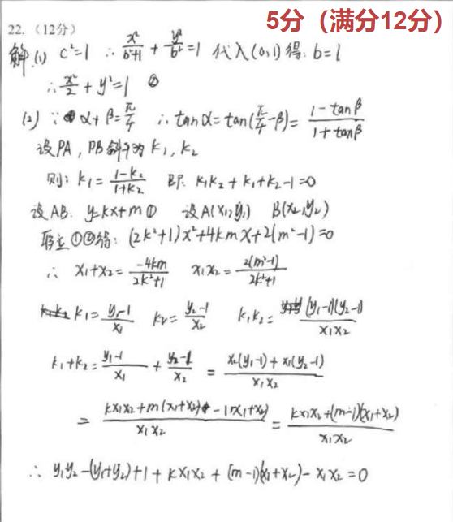

### 历史渊源
#### 2021年7月份，与马靖耗费一个晚自习，共同研究当年新高考I卷T22，第一次遇到这种类型的题。

#### 2021年2月份，高三上学期数学期末考试T22，当时没算出结果，出考场捶胸顿足。

#### 2021年2月份，网课期间一道相同题型的题被北校一同学秒杀，史梓豪表示佩服，我决定研究出来分享与他。
#### 2021年2月份，趁寒假功夫专心研究，并结合程序设计，找出数值解的解法。

[数值解.html](../I/index.html)
#### 2021年7月份，在知乎看到一篇相同题型的解析解，却无力再研究
[圆锥曲线上点弦的斜率问题 - 知乎](https://zhuanlan.zhihu.com/p/363747963)
#### 2022年2月9日，闲而无事做了几道高三的解析几何题目，翻弄出geogebra收藏夹，发现尘封已久的这个题，求出解析解
[解析解.html](main.html)