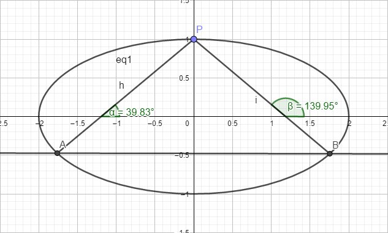

## 椭圆共点定角弦性质探究

>**$P(x_0,y_0)为椭圆C:\dfrac{x^2}{a^2}+\dfrac{y^2}{b^2}=1上一定点.PA、PB为椭圆的两条动弦，其倾斜角分别为\alpha、\beta，且\alpha+\beta=\theta，\theta\in[0,2\pi).$**

### 结论
$当\tan\theta = 0时，直线AB斜率k = \dfrac{b^2}{a^2} \cdot \dfrac{x_0}{y_0} 为定值$
$当\tan\theta 不存在时，直线AB恒过定点(\dfrac{x_0(a^2+b^2)}{a^2-b^2}, -\dfrac{y_0(a^2+b^2)}{a^2-b^2})$
$当\tan\theta 存在且不为0时，直线AB恒过定点(\dfrac{x_0(a^2+b^2)}{a^2-b^2} - \dfrac{2a^2y_0}{(a^2-b^2)\tan\theta}, -\dfrac{y_0(a^2+b^2)}{a^2-b^2} - \dfrac{2b^2x_0}{(a^2-b^2)\tan\theta})$

### 证明
$
设直线AB：y=kx+m，A(x_1, y_1)，B(x_2, y_2)，PA、PB斜率为k_1=\tan\alpha、k_2=\tan\beta，直线AB恒过定点Q \\
联立
\begin{cases}
\dfrac{x^2}{a^2}+\dfrac{y^2}{b^2}=1 \\
y=kx+m \\
\end{cases}
得：(a^2k^2 + b^2)x^2 + 2a^2kmx + a^2(m^2 - b^2) = 0 \\
x_1 + x_2 = \dfrac{-2a^2km}{a^2k^2 + b^2} (1)\\
x_1x_2 = \dfrac{a^2(m^2 - b^2)}{a^2k^2 + b^2} (2)\\
y_1 + y_2 = k(x_1 + x_2) +2m = \dfrac{2b^2m}{a^2k^2 + b^2} (3)\\
y_1y_2 = (kx_1 + m)(kx_2 +m) = \dfrac{b^2(m^2 - a^2k^2)}{a^2k^2 + b^2} (4)\\
y_1x_2 + y_2x_1 = \dfrac{-2a^2b^2k}{a^2k^2 + b^2} (5)\\
因为 k_1 = \dfrac{y_1 - y_0}{x_1 - x_0}, k_2 = \dfrac{y_2 - y_0}{x_2 - x_0} \\
所以 \\
k_1 \cdot k_2 = \dfrac{(y_1 - y_0)(y_2 - y_0)}{(x_1 - x_0)(x_2 - x_0)}
                = \dfrac{y_1y_2 - y_0(y_1 + y_2) + y_0^2}{x_1x_2 - x_0(x_1 + x_2) + x_0^2} (*)\\
k_1 + k_2 = \dfrac{y_1 - y_0}{x_1 - x_0} + \dfrac{y_2 - y_0}{x_2 - x_0}
            = \dfrac{(y_1 - y_0)(x_2 - x_0)+(y_2 - y_0)(x_1 - x_0)}{(x_1 - x_0)(x_2 - x_0)} 
            = \dfrac{y_1x_2 + y_2x_1 - x_0(y_1 + y_2) - y_0(x_1 + x_2) + 2x_0y_0}{x_1x_2 - x_0(x_1 + x_2) + x_0^2} (**)
$
#### 当tanθ = 0时
因为 $\alpha = \theta - \beta$
所以 $\tan\alpha = \tan(\theta - \beta) = \dfrac{\tan\theta-\tan\beta}{1 + {\tan\theta} \cdot {\tan\beta}} = -\tan\beta$
即：$\tan\alpha + \tan\beta = 0$
即：$k_1 + k_2 = 0$
把(*)代入得
>$ y_1x_2 + y_2x_1 - x_0(y_1 + y_2) - y_0(x_1 + x_2) + 2x_0y_0 = 0 $

把$(1)(2)(3)(4)(5)$代入得
>$ -2a^2b^2k -x_0(2b^2m) - y_0(-2a^2km) + 2x_0y_0(a^2k^2 + b^2) = 0 $

整理得
>$ (a^2y_0k - b^2x_0)m + a^2x_0y_0k^2 - a^2b^2k + b^2x_0y_0 = 0 $

>$\biggr\{ 
\begin{array}{l}
            a^2y_0k - b^2x_0 = 0  \\ 
            a^2x_0y_0k^2 - a^2b^2k + b^2x_0y_0 = 0
\end{array}$

由前式得 $k = \dfrac {b^2}{a^2} \cdot \dfrac {x_0}{y_0}$

代入后式检验得 $\dfrac {b^2x_0^2}{a^2y_0} - \dfrac {b^2}{y_0} + y_0 = 0$

整理得 $\dfrac{x^2}{a^2}+\dfrac{y^2}{b^2}=1$ 成立

所以该方程的解为 $k = \dfrac{b^2}{a^2} \cdot \dfrac{x_0}{y_0} $

#### 当tanθ不存在时
$\theta = \dfrac{\pi}{2}或\dfrac{3\pi}{2}$
因为 $\alpha = \theta - \beta$
所以 $\tan\alpha = \tan(\theta - \beta) = \dfrac{\sin(\theta - \beta)}{\cos(\theta - \beta)} = \dfrac{\cos\beta}{\sin\beta} = \dfrac{1}{\tan\beta}$
即：$\tan\alpha \cdot \tan\beta = 1$
即：$k_1 \cdot k_2 = 1$
把(**)代入式得
>$ y_1y_2 - y_0(y_1 + y_2) + y_0^2 - x_1x_2 + x_0(x_1 + x_2) - x_0^2 = 0 $

把$ (1)(2)(3)(4) $代入得
>$ b^2(m^2 - a^2k^2) - y_0(2b^2m) -a^2(m^2 - b^2) + x_0(-2a^2km) +(y_0^2 - x_0^2)(a^2k^2 + b^2) = 0 $

整理得
>$ (a^2 - b^2)m^2 + 2(a^2x_0k + b^2y_0)m + a^2(b^2 + x_0^2 - y_0^2)k^2 + b^2(-a^2 + x_0^2 - y_0^2) = 0 $

代入$a^2y^2+b^2x^2=a^2b^2$得
>$ (a^2 - b^2)m^2 + 2(a^2x_0k + b^2y_0)m + x^2(a^2 + b^2)k^2 - y^2(a^2 + b^2) = 0 $

设$ m = \lambda k + \mu $并代入得
>$ (a^2 - b^2)(\lambda^2k^2 + 2\lambda\mu k + \mu^2) + 2(a^2x_0k + b^2y_0)(\lambda k + \mu) + x^2(a^2 + b^2)k^2 - y^2(a^2 + b^2) = 0 $

整理得
>$ [(a^2 - b^2)\lambda^2 + 2a^2x_0\lambda + x_0^2(a^2 + b^2)]k^2 + [2(a^2 - b^2)\lambda\mu + 2a^2x_0\mu + 2b^2y_0\lambda]k + (a^2 - b^2)\mu^2 + 2b^2y_0\mu - y_0(a^2 + b^2) = 0 $

>$\Biggr\{ 
\begin{array}{l}
            (a^2 - b^2)\lambda^2 + 2a^2x_0\lambda + x_0^2(a^2 + b^2) = 0  \\ 
            2(a^2 - b^2)\lambda\mu + 2a^2x_0\mu + 2b^2y_0\lambda = 0 \\
            (a^2 - b^2)\mu^2 + 2b^2y_0\mu - y_0(a^2 + b^2) = 0
\end{array}$

因式分解得
>$\Biggr\{ 
\begin{array}{l}
            (\lambda + x_0)[(a^2 - b^2)\lambda + x_0(a^2 + b^2)] = 0  \\ 
            2(a^2 - b^2)\lambda\mu + 2a^2x_0\mu + 2b^2y_0\lambda = 0 \\
            (\mu - y_0)[(a^2 - b^2)\mu + y_0(a^2 + b^2)] = 0
\end{array}$

解1式得
>$\lambda = -x_0 或 \lambda = -\dfrac{x_0(a^2+b^2)}{a^2-b^2}$

解3式得
>$\mu = y_0 或 \mu = -\dfrac{y_0(a^2+b^2)}{a^2-b^2}$

把$ m = \lambda k + \mu $代入$ y = kx + b $得
>$ y = kx + \lambda k + \mu  = k(x + \lambda) + \mu $恒过点$(-\lambda, \mu)$

经检验得
>当$\{\lambda = -x_0, \mu = y_0\}$时，点为$(x_0, y_0)$与点$P$重合，舍去

故直线$AB$恒过定点为$(\dfrac{x_0(a^2+b^2)}{a^2-b^2}, -\dfrac{y_0(a^2+b^2)}{a^2-b^2})$

#### 当tanθ存在且不为0时
因为 $\alpha = \theta - \beta$
所以 $\tan\alpha = \tan(\theta - \beta) = \dfrac{\tan\theta-\tan\beta}{1 + {\tan\theta} \cdot {\tan\beta}}$
即：$ \tan\theta \cdot \tan\alpha \cdot \tan\beta + \tan\alpha + \tan\beta - \tan\theta = 0 $
即：$\tan\theta k_1k_2 + k_1 + k_2 -\tan\theta = 0$
把(*)(**)代入得
>$ \tanθ[y_1y_2 - y_0(y_1 + y_2) + y_0^2] + y_1x_2 + y_2x_1 - x_0(y_1 + y_2) - y_0(x_1 + x_2) + 2x_0y_0 - \tanθ[x_1x_2 - x_0(x_1 + x_2) + x_0^2] = 0 $

整理得
>$ \tanθy_1y_2 - \tanθx_1x_2 + y_1x_2 + y_2x_1 + (y_1 + y_2)(-y_0\tanθ - x_0) + (x_1 + x_2)(x\tanθ - y_0) + \tanθ(y_0^2 - x_0^2) + 2x_0y_0= 0 $ 

把$ (1)(2)(3)(4)(5) $代入得
>$ \tanθb^2(m^2 - a^2k^2) - \tanθa^2(m^2 - b^2) +(-2a^2b^2k) +2b^2m(-y_0\tanθ - x_0) + (-2a^2km)(x\tanθ - y_0)+
  (a^2k^2 + b^2)(\tanθ(y_0^2 - x_0^2) + 2x_0y_0) = 0 $

整理得
>$ (a^2-b^2)\tanθ \cdot m^2 + [2a^2(x_0\tanθ - y_0)k + 2b^2(y_0\tanθ + x_0)]m + 
  a^2[\tanθ(b^2 + x_0^2 - y_0^2) - 2x_0y_0]k^2 + 2a^2b^2k + b^2[\tanθ(-a^2 + x_0^2 - y_0^2) - 2x_0y_0] = 0 $

代入$a^2y^2+b^2x^2=a^2b^2$得
>$ (a^2-b^2)\tanθ \cdot m^2 + [2a^2(x_0\tanθ - y_0)k + 2b^2(y_0\tanθ + x_0)]m + 
  [x_0^2(a^2 + b^2)\tanθ - 2a^2x_0y_0]k^2 + 2a^2b^2k - [y_0^2(a^2 + b^2)\tanθ + 2b^2x_0y_0] = 0 $

设$ m = \lambda k + \mu $并代入得
>$ (a^2 - b^2)\tan\theta(\lambda^2k^2 + 2\lambda\mu k + \mu^2) + [2a^2(x_0\tanθ - y_0)k + 2b^2(y_0\tanθ + x_0)](\lambda k + \mu) + [x_0^2(a^2 + b^2)\tanθ - 2a^2x_0y_0]k^2 + 2a^2b^2k - [y_0^2(a^2 + b^2)\tanθ + 2b^2x_0y_0] = 0 $

整理得
>$ [(a^2 - b^2)\tan\theta\lambda^2 + 2a^2(x_0\tanθ - y_0)\lambda + x_0^2(a^2 + b^2)\tanθ - 2a^2x_0y_0]k^2 + 
   [2(a^2 - b^2)\tan\theta\lambda\mu + 2a^2(x_0\tan\theta - y_0)\mu + 2b^2(y_0\tan\theta + x_0)\lambda + 2a^2b^2]k +
   (a^2 - b^2)\tan\theta\mu^2 + 2b^2(y_0tanθ + x_0)\mu - y_0^2(a^2 + b^2)tanθ - 2b^2x_0y_0 = 0 $

>$\Biggr\{ 
\begin{array}{l}
            (a^2 - b^2)\tan\theta\lambda^2 + 2a^2(x_0tanθ - y_0)\lambda + x_0^2(a^2 + b^2)tanθ - 2a^2x_0y_0 = 0  \\ 
            2(a^2 - b^2)\tan\theta\lambda\mu + 2a^2(x_0\tan\theta - y_0)\mu + 2b^2(y_0\tan\theta + x_0)\lambda + 2a^2b^2 = 0 \\
            (a^2 - b^2)\tan\theta\mu^2 + 2b^2(y_0tanθ + x_0)\mu - y_0^2(a^2 + b^2)tanθ - 2b^2x_0y_0 = 0
\end{array}$

因式分解得
>$\Biggr\{ 
\begin{array}{l}
            (\lambda + x_0)[(a^2 - b^2)\tan\theta\lambda + x_0(a^2 + b^2) - 2a^2y_0] = 0  \\ 
            2(a^2 - b^2)\lambda\mu + 2a^2x_0\mu + 2b^2y_0\lambda = 0 \\
            (\mu - y_0)[(a^2 - b^2)\tan\theta\mu + y_0(a^2 + b^2) + 2b^2x_0] = 0
\end{array}$

解1式得
>$\lambda = -x_0 或 \lambda = -\dfrac{x_0(a^2+b^2)}{a^2-b^2} + \dfrac{2a^2y_0}{(a^2-b^2)\tan\theta}$

解3式得
>$\mu = y_0 或 \mu = -\dfrac{y_0(a^2+b^2)}{a^2-b^2} - \dfrac{2b^2x_0}{(a^2-b^2)\tan\theta}$

把$ m = \lambda k + \mu $代入$ y = kx + b $得
>$ y = kx + \lambda k + \mu  = k(x + \lambda) + \mu $恒过点$(-\lambda, \mu)$

经检验得
>当$\{\lambda = -x_0, \mu = y_0\}$时，点为$(x_0, y_0)$与点$P$重合，舍去

故直线$AB$恒过定点为$(\dfrac{x_0(a^2+b^2)}{a^2-b^2} - \dfrac{2a^2y_0}{(a^2-b^2)\tan\theta}, -\dfrac{y_0(a^2+b^2)}{a^2-b^2} - \dfrac{2b^2x_0}{(a^2-b^2)\tan\theta})$
