## 无向图：深度优先遍历DFS/广度优先遍历BFS

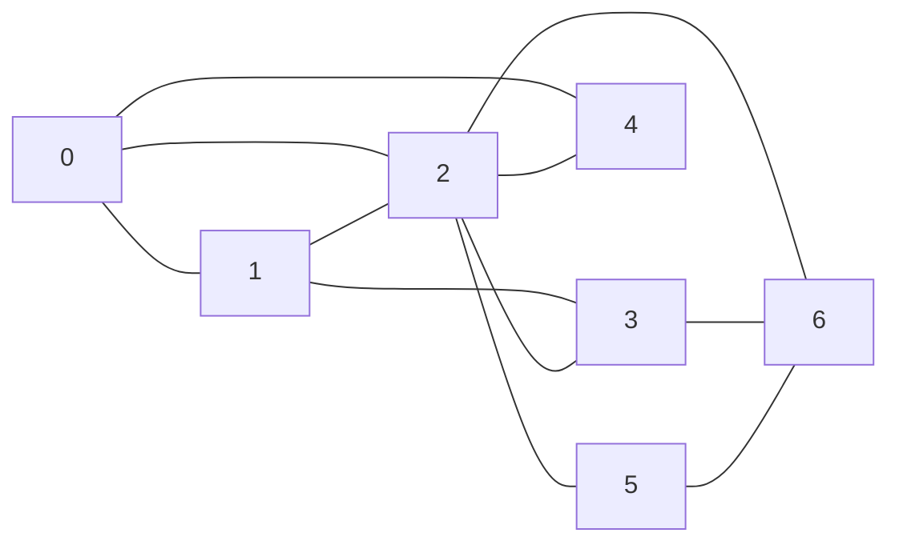

### dfs-tree

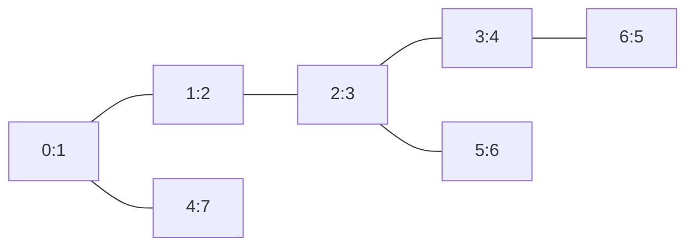

### bfs-tree

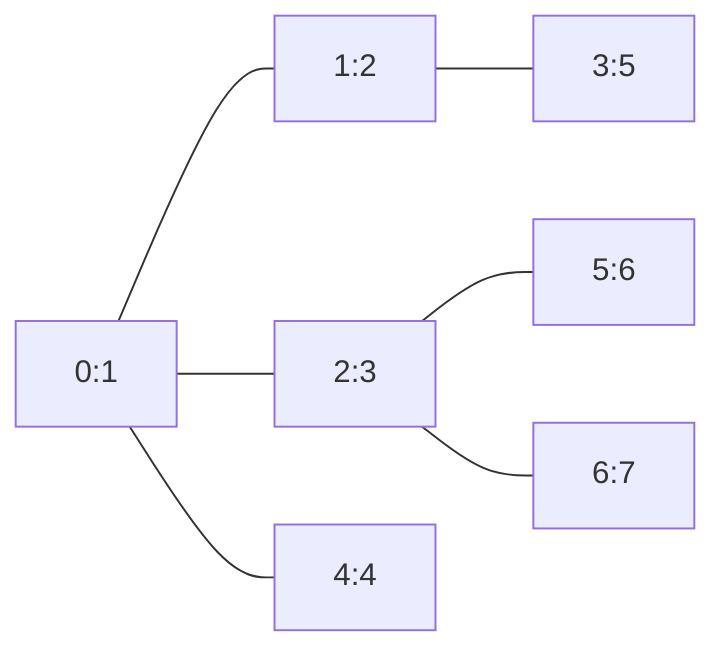

## 无向图：FloodFill

| S | 0 | 1 | 0 |
| - | - | - | - |
| 0 | 0 | 0 | 0 |
| 0 | 0 | 1 | 0 |
| 0 | 1 | E | 0 |
| 0 | 0 | 0 | 1 |

### step-map

| 0 | 1  | ∞ | 5  |
| - | -- | -- | -- |
| 1 | 2  | 3  | 4  |
| 2 | 3  | ∞ | 5  |
| 3 | ∞ | 7  | 6  |
| 4 | 5  | 6  | ∞ |

## 加权图：最小生成树MST/最短路径SSSP&APSP

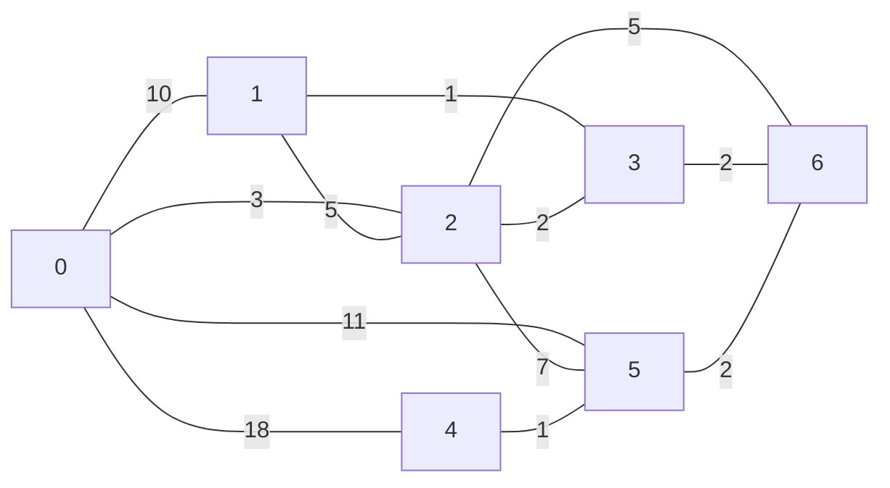

### MST=11

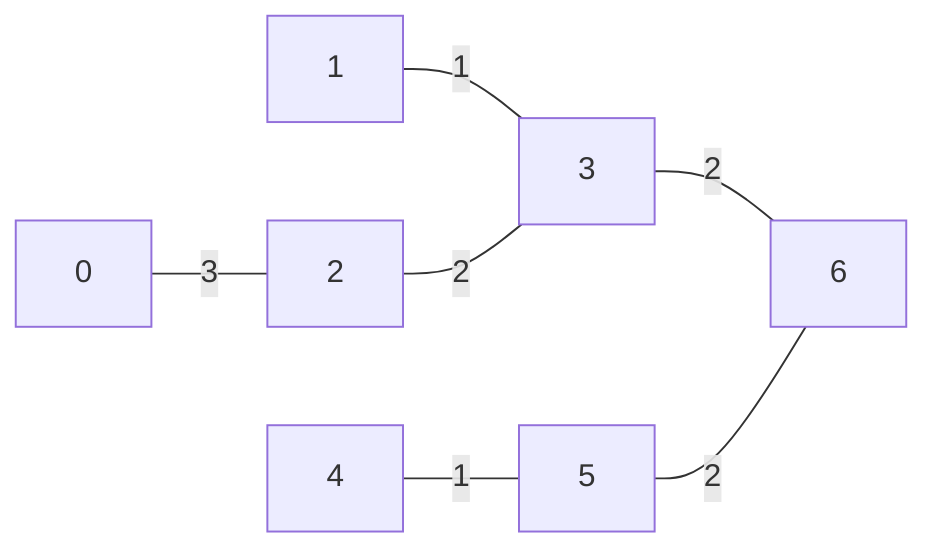

### SSSP

| i    | 0 | 1 | 2 | 3 | 4  | 5 | 6 |
| ---- | - | - | - | - | -- | - | - |
| dist | 0 | 6 | 3 | 5 | 10 | 9 | 7 |


## DAG：拓扑排序

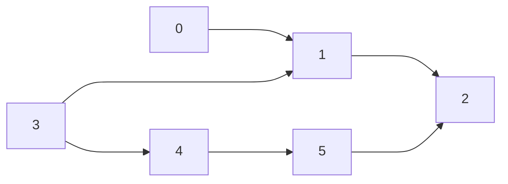

### tsort


## 树

### 树的直径

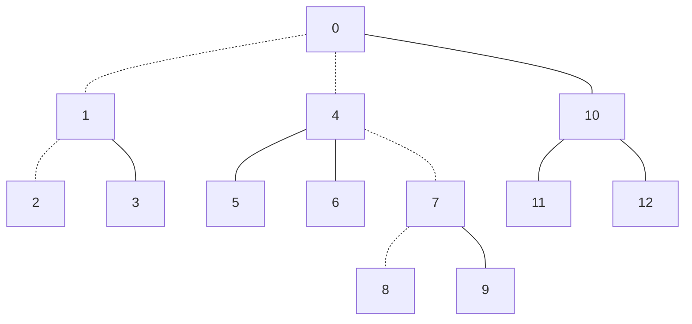

## 无向图：连通性

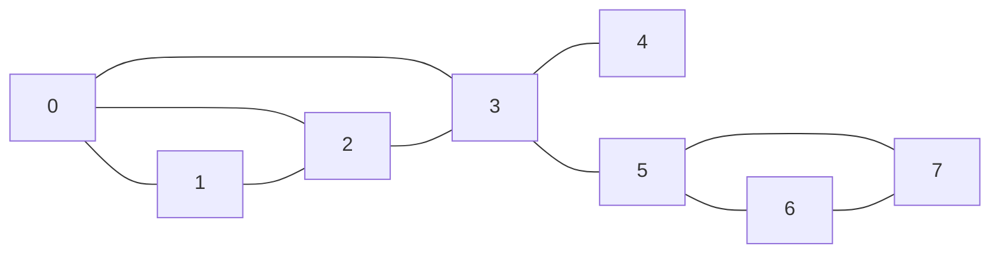

### dfs树的树边，背向边，dfs序

> 对于dfs树，树边 + 背向边 = 图边

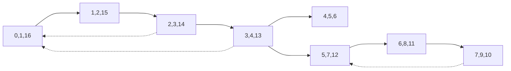

### 割点

充要条件

* `low[v] >= dfn[u]`
* `child >= 2`

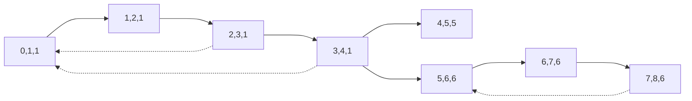

### 桥

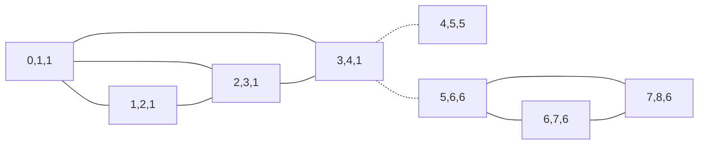

## 有向图：强连通分量

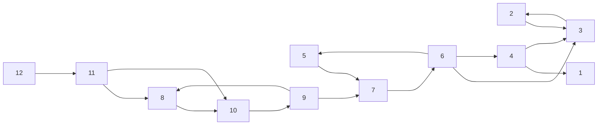

### kosaraju

#### dfs后序遍历生成表


#### 反向图，以postorder表的倒序进行遍历，可连通则染色

```mermaid
flowchart RL
3--->2
2--->3
1--->4
3--->4
7--->5
3--->6
4--->6
5--->6
6--->7
10--->8
7--->9
8--->9
9--->10
8--->11
10--->11
11--->12
```

#### 强连通分量 = 7

```mermaid
flowchart LR
1[1,7]
2[2,6]
3[3,6]
4[4,5]
5[5,4]
6[6,4]
7[7,4]
8[8,3]
9[9,3]
10[10,3]
11[11,2]
12[12,1]
2--->3
3--->2
4--->1
4--->3
5--->7
6--->3
6--->4
6--->5
7--->6
8--->10
9--->7
9--->8
10--->9
11--->8
11--->10
12--->11
```

#### 缩点DAG

```mermaid
flowchart LR
1["{12,}"]
1--->2
2["{11,}"]
2--->3
3["{8,9,10,}"]
3--->4
4["{5,6,7,}"]
4--->5
4--->6
5["{4,}"]
5--->6
5--->7
6["{2,3,}"]
7["{1,}"]
```

### tarjan

`i, scc[i], dfn[i], low[i]`

```mermaid
flowchart LR
1["1,1,1,1"]
2["2,2,2,2"]
3["3,2,3,2"]
4["4,3,4,4"]
5["5,4,5,5"]
6["6,4,7,5"]
7["7,4,6,5"]
8["8,5,8,8"]
9["9,5,10,8"]
10["10,5,9,8"]
11["11,6,11,11"]
12["12,7,12,12"]
2--->3
3--->2
4--->1
4--->3
5--->7
6--->3
6--->4
6--->5
7--->6
8--->10
9--->7
9--->8
10--->9
11--->8
11--->10
12--->11
```
