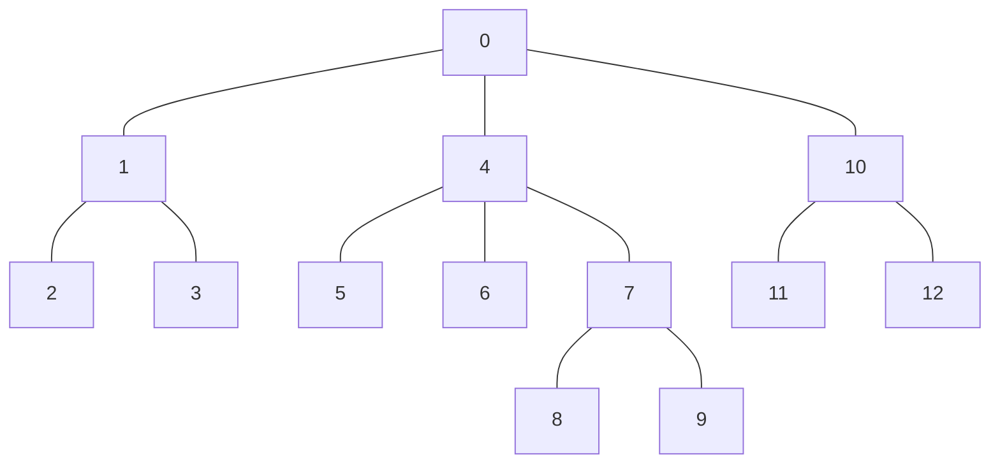
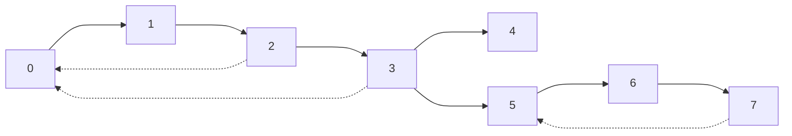
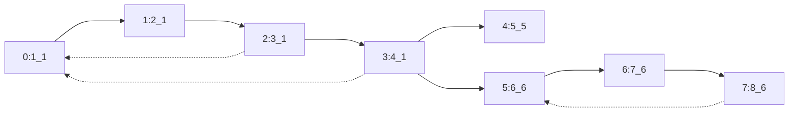
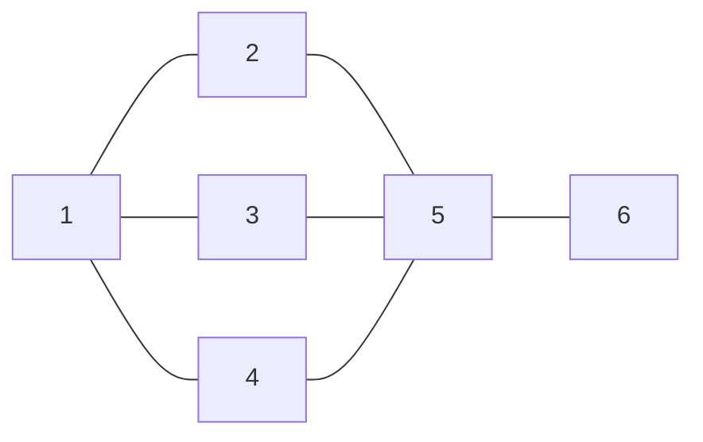

## 无向图：深度优先遍历DFS/广度优先遍历BFS


### dfs-tree


### bfs-tree


## 无向图：floodfill

| S | 0 | 1 | 0 |
| - | - | - | - |
| 0 | 0 | 0 | 0 |
| 0 | 0 | 1 | 0 |
| 0 | 1 | E | 0 |
| 0 | 0 | 0 | 1 |

### step-map

| 0 | 1  | ∞ | 5  |
| - | -- | -- | -- |
| 1 | 2  | 3  | 4  |
| 2 | 3  | ∞ | 5  |
| 3 | ∞ | 7  | 6  |
| 4 | 5  | 6  | ∞ |

## 加权图：最小生成树MST/最短路径SSSP&APSP


### MST=11


### SSSP

| i  | 0 | 1 | 2 | 3 | 4  | 5 | 6 |
| -- | - | - | - | - | -- | - | - |
| sp | 0 | 6 | 3 | 5 | 10 | 9 | 7 |


## DAG：拓扑排序


### tsort


## 树



## 无向图：连通性


### dfs树的树边，背向边

> 对于dfs树，树边 + 背向边 = 图边



### 割点

充要条件

* `low[v] >= dfn[u]`
* `chrld >= 2`





## 有向图：强连通分量


### kosaraju
#### dfs后序(postorder)遍历生成表


#### 反向图，以postorder表的倒序进行遍历，可连通则染色

```mermaid
flowchart RL
3--->2
2--->3
1--->4
3--->4
7--->5
3--->6
4--->6
5--->6
6--->7
10--->8
7--->9
8--->9
9--->10
8--->11
10--->11
11--->12
```

#### 强连通分量 = 7
```mermaid
flowchart LR
1[1:7]
2[2:6]
3[3:6]
4[4:5]
5[5:4]
6[6:4]
7[7:4]
8[8:3]
9[9:3]
10[10:3]
11[11:2]
12[12:1]
2--->3
3--->2
4--->1
4--->3
5--->7
6--->3
6--->4
6--->5
7--->6
8--->10
9--->7
9--->8
10--->9
11--->8
11--->10
12--->11
```
#### 缩点DAG

```mermaid
flowchart LR
1[12]
2[11]
3[8,9,10]
4[5,6,7]
5[4]
6[2,3]
7[1]
1--->2--->3--->4--->5--->7
5--->6
4--->6
```
### tarjan
```mermaid
flowchart LR
1[1:1_1]
2[2:2_2]
3[3:3_2]
4[4:4_4]
5[5:5_5]
6[6:7_5]
7[7:6_5]
8[8:8_8]
9[9:10_8]
10[10:9_8]
11[11:11_11]
12[12:12_12]
2--->3
3--->2
4--->1
4--->3
5--->7
6--->3
6--->4
6--->5
7--->6
8--->10
9--->7
9--->8
10--->9
11--->8
11--->10
12--->11
```

