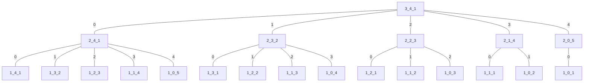
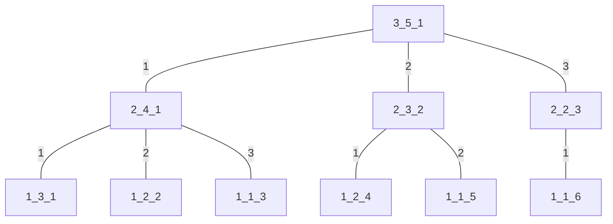

### Diophantine方程的非负整数解

```cpp
int cnt = 0, x[m + 1];
void dfs(int m, int n)
{
    cnt++;
    if (m == 1)
    {
        x[m] = n;
        /* code */
        return;
    }
    for (int i = 0; i <= n; i++)
    {
        x[m] = i;
        dfs(m - 1, n - i);
    }
}
```
`dfs()`功能是求解符合条件$\sum_{i=1}^m x_i = n$的非负整数数列$\{x_i\}$，`cnt`为时间总代价
$dfs:\{m,n\}\rightarrow \{x_i\} (\sum_{i=1}^m x_i = n,x_i \in \mathbb{N})$
**对于$\{m,n\}$，解符合条件的$\{x_i\}$的方案数$=f(m,n)=C_{m+n-1}^{m-1}$**
>证明：设$f(m,n)$表示给定$\{m,n\}$求得的方案数
$f(m,n)=\Big\{ \begin{matrix} 1,m=1 \\ \sum_{i=0}^n f(m-1,n-i),m>1且m \in \mathbb{Z} \end{matrix}$
$f(m,n)$有两个性质:
**$\sum_{i=0}^n f(m,i) = f(m+1,n)$**
**$\sum_{i=1}^m f(i,n) = f(m,n+1)$**
>有限次迭代枚举，得函数值列表
>|     | 1   | 2   | 3   | 4   | 5   | ··· | m        |
>| --- | --- | --- | --- | --- | --- | --- | -------- |
>| 0   | 1   | 1   | 1   | 1   | 1   |     |          |
>| 1   | 1   | 2   | 3   | 4   | 5   |     |          |
>| 2   | 1   | 3   | 6   | 10  | 15  |     |          |
>| 3   | 1   | 4   | 10  | 20  | 35  |     |          |
>| 4   | 1   | 5   | 15  | 35  | 70  |     |          |
>| ··· |     |     |     |     |     |     |          |
>| n   |     |     |     |     |     |     | $f(m,n)$ |
>
>不难发现，自左下到右上每一斜对角线上的数字恰好对应杨辉三角的某行
>第$m+n-1$斜行对应杨辉三角第$y$行，自左下数第$m-1$个对应该行第$x$个数字
>即：$f(m,n)=C_y^x=C_{m+n-1}^{m-1}$

**对于$\{m,n\}$，`dfs(m,n)`时间复杂度$=O(C_{m+n}^{m-1})$**
>证明：
打印`dfs(3,3,4)`的递归树
`m_n_cnt = dfs(m,n)`

>设$T(m,n)$为`dfs(m,n)`的运行时间
可得递归式$T(m,n)=\Big\{\begin{matrix} 0,m=1 \\ \sum_{i=0}^n T(m-1,n-i)+\Theta(n+1),m>1且m \in \mathbb{Z} \end{matrix}$
重写为$T(m,n)=\Big\{\begin{matrix} 0,m=1 \\ \sum_{i=0}^n T(m-1,n-i)+c(n+1),m>1且m \in \mathbb{Z} \end{matrix}$
其中$c$为调用一次函数的时间代价
于是
设$T_i$为第$i$层时间代价和,则
$T_m=c(n+1)=\sum_{i_0=0}^{n}c=c\cdot f(2,n)$
$T_{m-1}=c((n+1)+n+\cdots+1)=\sum_{i_0=0}^{n}\sum_{i_1=0}^{i_0}c=c\cdot f(3,n) \\ \cdots $
$T_2=c\cdot f(m,n)$
$T_1=0$
加上主函数调用`dfs(m,n)`时间$c=c\cdot f(1,n)$
则:$T(n)=\sum_{i=2}^m T_i+c=c\cdot\sum_{i=2}^{m} f(i,n)+c\cdot f(1,n)=c\cdot\sum_{i=1}^{m}f(i,n)=c\cdot f(m,n+1)=c\cdot C_{m+n}^{m-1}$
即:时间复杂度为$=O(C_{m+n}^{m-1})$

### Diophantine方程的正整数解

```cpp
int cnt = 0, x[m + 1];
void dfs(int m, int n)
{
    cnt++;
    if (m == 1)
    {
        x[m] = n;
        /* code */
        return;
    }
    for (int i = 1; i <= n - m + 1; i++)
    {
        x[m] = i;
        dfs(m - 1, n - i);
    }
}
```
`dfs()`功能是求解符合条件$\sum_{i=1}^m x_i = n$的正整数数列$\{x_i\}$，`cnt`为时间总代价
$dfs:\{m,n\}\rightarrow \{x_i\} (\sum_{i=1}^m x_i = n,x_i \in \mathbb{Z_+})$
**对于$\{m,n\}$，解符合条件的$\{x_i\}$的方案数$=C_{n-1}^{m-1}$**
>证明：设$g(m,n)$表示给定$\{m,n\}$求得的方案数
$g(m,n)=\Big\{ \begin{matrix} 1,m=1 \\ \sum_{i=1}^{n-m+1} f(m-1,n-i),m>1且m \in \mathbb{Z} \end{matrix}$
>有限次迭代枚举，得函数值列表
>|     | 1   | 2   | 3   | 4   | ··· | m        |
>| --- | --- | --- | --- | --- | --- | -------- |
>| 1   | 1   | -   | -   | -   |     |          |
>| 2   | 1   | 1   | -   | -   |     |          |
>| 3   | 1   | 2   | 1   | -   |     |          |
>| 4   | 1   | 3   | 3   | 1   |     |          |
>| ··· |     |     |     |     |     |          |
>| n   |     |     |     |     |     | $g(m,n)$ |
>
>不难发现，第$n-1$斜行对应杨辉三角第$y$行，第$m-1$个对应该行第$x$个数字
>即：$g(m,n)=C_y^x=C_{n-1}^{m-1}$

**对于$\{m,n\}$，`dfs(m,n)`时间复杂度$=O(C_n^{m-1})$**
>证明：
打印`dfs(3,3,5)`的递归树
`m_n_cnt = dfs(m,n)`

>设$T(m,n)$为`dfs(m,n)`的运行时间
可得递归式$T(m,n)=\Big\{\begin{matrix} 1,m=1 \\ \sum_{i=1}^{n-m+1} T(m-1,n-i)+\Theta(n-m+1),m>1且m \in \mathbb{Z} \end{matrix}$
重写为$T(m,n)=\Big\{\begin{matrix} 1,m=1 \\ \sum_{i=1}^{n-m+1} T(m-1,n-i)+c(n-m+1),m>1且m \in \mathbb{Z} \end{matrix}$
其中$c$为调用一次函数的时间代价
于是
设$T_i$为第$i$层时间代价和,则
$T_m=c\cdot(n-m+1)=c\cdot f(n-m+1,1)$
$T_{m-1}=c\cdot(1+2+3+\cdots+n-m+1)=c\cdot f(n-m+1,2)$
$T_{m-2}=c\cdot(1+3+6+\cdots+\frac{(n-m+2)(n-m+1)}{2})=c\cdot f(n-m+1,3)\\ \cdots$
$T_i=c\cdot f(n-m+1,m+1-i) \\ \cdots$
$T_2=c\cdot f(n-m+1,m-1)$
加上主函数调用`dfs(m,n)`时间$c=c\cdot f(n-m+1,0)$
则:$T(m,n)=\sum_{i=2}^{m} T_i+c=c\cdot\sum_{i=2}^{m} f(n-m+1,m+1-i)+c\cdot f(n-m+1,0) \\= c\cdot\sum_{i=2}^{m+1} f(n-m+1,m+1-i) = c\cdot\sum_{i=0}^{m-1} f(n-m+1,i) = f(n-m+2,m-1) = C_{n}^{n+1-m} = C_{n}^{m-1}$
即:时间复杂度为$O(C_n^{m-1})$