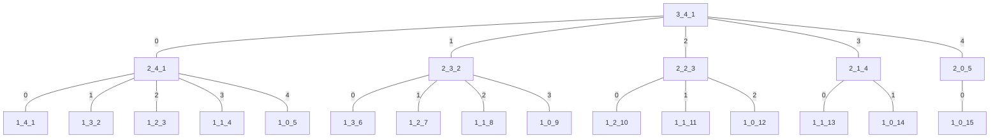

```mermaid
flowchart TB

```
|     | 1   | 2   | 3   | 4   | ··· | m        |
| --- | --- | --- | --- | --- | --- | -------- |
| 1   | 1   | -   | -   | -   |     |          |
| 2   | 1   | 1   | -   | -   |     |          |
| 3   | 1   | 2   | 1   | -   |     |          |
| 4   | 1   | 3   | 3   | 1   |     |          |
| ··· |     |     |     |     |     |          |
| n   |     |     |     |     |     | $f(m,n)$ |