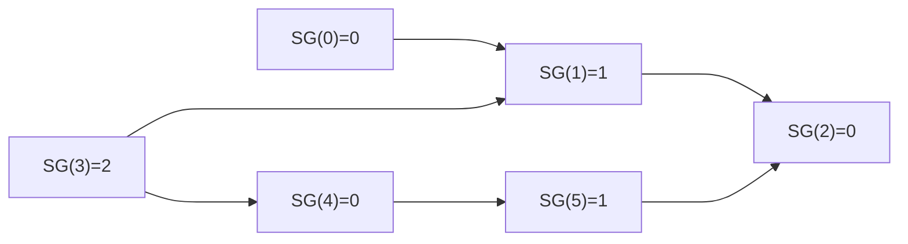

# 博弈论

## 巴什博奕(Bash Game)

> 给定 $n$ 个物品。两名玩家轮流行动，取走任意 $1$ ~ $k$ 个物品。取走最后一件物品者获胜。两人都采取最优策略，问先手能否必胜。

结论：**若 $(m+1)|n$ ，则先手必败，否则先手必胜**

当石子有 $1$ ~ $m$ 个时，先手必胜

当石子有 $m+1$ 个时，先手无论拿几个，后手都可以拿干净，先手必败

当石子有 $m+2$ ~ $2m$ 时，先手可以拿走几个，剩下 $m+1$ 个，先手必胜

不难发现，面临 $m+1$ 个石子的人一定失败

这样的话两个人的最优策略一定是通过拿走石子，使得对方拿石子时还有 $m+1$ 个

考虑往一般情况推广

- 设当前的石子数为 $n=k(m+1)+r$

  先手会首先拿走 $r$ 个，接下来假设后手拿走 $x$ 个，先手会拿走 $m+1−x$ 个，这样博弈下去后手最终一定失败

- 设当前的石子数为 $n=k(m+1)$

  假设先手拿 $x$ 个，后手一定会拿 $m+1−x$ 个，这样下去先手一定失败

## Nim游戏

> 给定 $n$ 堆物品，第 $i$ 堆物品有 $A_i$ 个。两名玩家轮流行动，每次可以任选一堆，取走任意多个物品，可把一堆取光，但不能不取。取走最后一件物品者获胜。两人都采取最优策略，问先手能否必胜。

结论：**若 $n$ 堆石子的数量异或和非 $0$ 时，则先手必胜，否则先手必败**

Nim游戏的必败态我们是知道的，就是当前 $n$ 堆石子的数量都为零

设 $a_i$ 表示第 $i$ 堆石子的数量，那么必败态局面就是

$0\ \mathrm{xor}\ 0\ \mathrm{xor}\ 0\ \mathrm{xor}\ ⋯\ \mathrm{xor}\ 0=0$

- 对于先手来说，如果当前局面是

​	$a_1\ \mathrm{xor}\ a_2\ \mathrm{xor}\ a_3\ \mathrm{xor}\ ⋯\ \mathrm{xor}\ a_n=k$

​	那么一定存在某个 $a_i$ ，它的二进制表示在最高位 $k$ 上一定是 $1$

​	我们将 $a_i\ \mathrm{xor}\ k$，这样就变成了

​	$a_1\ \mathrm{xor}\ a_2\ \mathrm{xor}\ a_3\ \mathrm{xor}\ ⋯\ \mathrm{xor}\ a_n\ \mathrm{xor}\ k=0$

​	此时先手必胜

- 对于先手来说，如果当前局面是

​	$a_1\ \mathrm{xor}\ a_2\ \mathrm{xor}\ a_3\ \mathrm{xor}\ ⋯\ \mathrm{xor}\ a_n=0$

​	那么我们不可能将某一个 $a_i$ 异或一个非零数字后使得

​	$a_1\ \mathrm{xor}\ a_2\ \mathrm{xor}\ a_3\ \mathrm{xor}\ ⋯\ \mathrm{xor}\ a_n=0$

​	此时先手必败

## 公平组合游戏ICG

1. 由两名玩家交替行动。
2. 在游戏进程的任意时刻，可以执行的合法行动与轮到哪名玩家无关。
3. 不能行动的玩家判负。

满足上述条件的问题我们称之为ICG

最典型的Nim游戏，就是一种ICG游戏

## 必胜态与必败态

定义P-position与N-position

P-position：必败态(简记为**P**)，即Previous-position,你可以直观的认为处于这种状态的人最后一定会输

N-position：必胜态(简记为**N**)，即Next-position，你可以直观的理解为处于这种状态的人最后一定会赢

这仅仅是最直观的定义

更严谨的定义为：

1. 无法移动的状态(即terminal-position)为P
2. **存在**移动可以进入P的局面为N
3. **所有**移动都会进入N的局面为P

## DAG博弈

> 给定一个有向无环图，图中有一个唯一的起点，在起点上放有一枚棋子。两名玩家交替地把这枚棋子沿有向边进行移动，每次可以移动
> 一步，无法移动者判负。该游戏被称为有向图游戏。

任何一个公平组合游戏都可以转化为有向图游戏。把每个局面看成图中的一个节点，并且从每个局面向沿着合法行动能够到达的下一个局面连有向边。

## Mex运算

设 $S$ 表示一个非负整数集合。定义 $\operatorname{mex}(S)$ 为求出不属于集合 $S$ 的最小非负整数的运算，即:
$\operatorname{mex}(S)=\min\{x|x\in\mathbb{N},x\notin S\}$

## SG函数

SG(Sprague-Grundy)函数是人们在研究博弈论的道路上迈出的重要一步，它把许多杂乱无章的博弈游戏通过某种规则结合在了一起，使得一类普遍的博弈问题得到了解决。从SG函数开始，我们不再是单纯的同过找规律等方法去解决博弈问题，而是需要学习一些博弈论中基本的定理，来找到他们的共同特点。

对于给定的有向无环图，定义每个点的SG函数为
$\operatorname{SG}(x)=\operatorname{mex}\{\operatorname{SG}(y)|x\ \mathrm{can\ go\ to}\ y\}$



$\operatorname{SG}(x)=0\iff x$ 对应的局面为必败态

$\operatorname{SG}(x)>0\iff x$ 对应的局面为必胜态

```cpp
// N:可转移状态的个数  f[N]:可转移状态的集合
// SG[]:SG(x)  S[]={SG(y)|x to y}
int f[MAXN], SG[MAXN], S[MAXN];
void getSG(int n)
{
    memset(SG, 0, sizeof(SG));
    for (int i = 1; i <= n; i++)
    {
        memset(S, 0, sizeof(S));
        for (int j = 0; f[j] <= i && j <= N; j++)
            S[SG[i - f[j]]] = 1;
        for (int j = 0;; j++)
            if (!S[j])
            {
                SG[i] = j;
                break;
            }
    }
}
```


## 有向图游戏的和

设 $G_1,G_2,\cdots,G_m$ 是 $m$ 个有向图游戏。定义有向图游戏 $G$，它的行动规则是任选某个有向图游戏 $G_i$，并在 $G_i$ 上行动一步。$G$ 被称为有向图游戏 $G_1, G_2,\cdots,G_m$ 的和。

有向图游戏的和的SG函数值等于它包含的各个子游戏SG函数值的异或和，即:

$\operatorname{SG}(G)=\operatorname{SG}(G_1)\operatorname{xor}\operatorname{SG}(G_2)\operatorname{xor}\cdots \operatorname{xor}\operatorname{SG}(G_m)$

## SG函数的应用

### Nim游戏

> 给定 $n$ 堆物品，第 $i$ 堆物品有 $A_i$ 个。两名玩家轮流行动，每次可以任选一堆，取走任意多个物品，可把一堆取光，但不能不取。取走最后一件物品者获胜。两人都采取最优策略，问先手能否必胜。

对于第 $i$ 堆物品，$\operatorname{SG}(A_i)=\operatorname{mex}\{\operatorname{SG}(A_i-1),\operatorname{SG}(A_i-2),\cdots,\operatorname{SG}(A_i-A_i)\}=A_i$

故 $\operatorname{SG}(A)=\operatorname{SG}(A_1)\operatorname{xor}\operatorname{SG}(A_2)\operatorname{xor}\cdots \operatorname{xor}\operatorname{SG}(A_n)=A_1\operatorname{xor}A_2\operatorname{xor}\cdots \operatorname{xor}A_n$

##  Anti-SG游戏

### Anti-Nim游戏

> 给定 $n$ 堆物品，第 $i$ 堆物品有 $A_i$ 个。两名玩家轮流行动，每次可以任选一堆，取走任意多个物品，可把一堆取光，但不能不取。取走最后一件物品者失败。两人都采取最优策略，问先手能否必胜。
