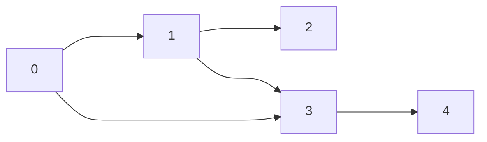
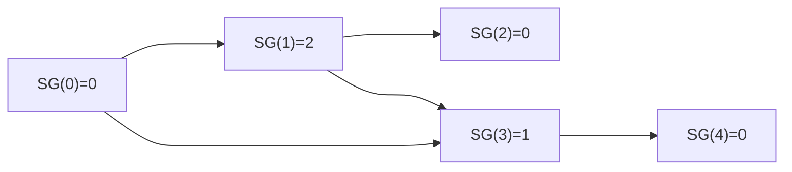

## 博弈论(Game Theory)

主要是组合博弈论。

1. 双人。
2. 只有胜或负。
3. 有限。

## 公平组合游戏(Impartial Combinatorial Games, ICG)

1. 两个选手交替进行预先规定好的操作。
2. 任何时刻，合法操作只取决于局面本身，与选手无关。
3. 不能合法操作的选手判负。

## 博弈状态

状态：可以理解为游戏的局面。

必胜态(Previous-position, P)：先手必胜的状态。

必败态(Next-position, N)：先手必胜的状态。

1. 游戏终止的状态为必胜态。
2. **存在**移动可以进入必胜态的局面为必败态。
3. **所有**移动都会进入必败态的局面为必胜态。

必胜的一直处于必胜态，必败的一直处于必败态。

## 巴什博奕(Bash Game)

> 给定 $n$ 个物品。两名玩家轮流行动，取走任意 $1\sim k$ 个物品。取走最后一件物品者获胜。

结论：若 $(k+1)|n$ ，则先手必败，否则先手必胜。

## Nim 游戏

> 给定 $n$ 堆物品，第 $i$ 堆物品有 $a_i$ 个。两名玩家轮流行动，每次可以任选一堆，取走任意多个物品，可把一堆取光，但不能不取。取走最后一件物品者获胜。

结论：若 $n$ 堆石子的数量异或和 $a_1\oplus a_2\oplus \ldots \oplus a_n$ 非 0 时，则先手必胜，否则先手必败

## 有向图游戏与 SG(Sprague–Grundy) 函数

> 给定一个有向无环图，图中有一个唯一的起点，在起点上放有一枚棋子。两名玩家交替地把这枚棋子沿有向边进行移动，每次可以移动一步，无法移动者判负。

大部分的公平组合游戏都可以转化为有向图游戏。把每个局面看成图中的一个节点，并且从每个局面向沿着合法行动能够到达的下一个局面连有向边。

### Mex 运算

设 $S$ 表示一个非负整数集合。定义 $\operatorname{mex}(S)$ 为求出不属于集合 $S$ 的最小非负整数的运算，即:

$\operatorname{mex}(S)=\min\{x|x\in\mathbb{N},x\notin S\}$

### SG 函数

对于状态 $x$ 和它的所有 $k$ 个后继状态 $y_1, y_2, \ldots, y_k$ ，定义 $\operatorname{SG}$ 函数：

$\operatorname{SG}(x)=\operatorname{mex}\{\operatorname{SG}(y)|x\to y\}=\operatorname{mex}\{\operatorname{SG}(y_1), \operatorname{SG}(y_2), \ldots, \operatorname{SG}(y_k)\}$

### 有向图游戏的和

设 $G_1,G_2,\cdots,G_m$ 是 $m$ 个有向图游戏。定义有向图游戏 $G$，它的行动规则是任选某个有向图游戏 $G_i$，并在 $G_i$ 上行动一步。$G$ 被称为有向图游戏 $G_1, G_2,\cdots,G_m$ 的和。

例：对于 Nim 游戏，每堆石子都是一个子游戏

### SG定理

有向图游戏的和的 $SG$ 函数值等于它包含的各个子游戏 $SG$ 函数值的异或和，即:

$\operatorname{SG}(G)=\operatorname{SG}(G_1)\oplus\operatorname{SG}(G_2)\oplus\cdots \oplus\operatorname{SG}(G_m)$

$\operatorname{SG}(x)=0\iff x$ 对应的局面为必败态

$\operatorname{SG}(x)>0\iff x$ 对应的局面为必胜态

SG 函数是人们在研究博弈论的道路上迈出的重要一步，它把许多杂乱无章的博弈游戏通过某种规则结合在了一起，使得一类普遍的博弈问题得到了解决。从SG函数开始，我们不再是单纯的同过找规律等方法去解决博弈问题，而是需要学习一些博弈论中基本的定理，来找到他们的共同特点。

