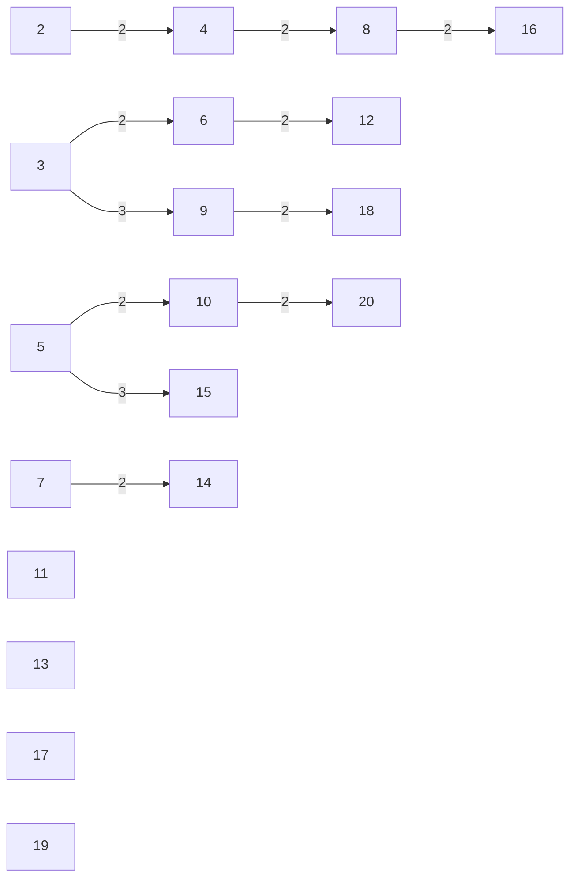
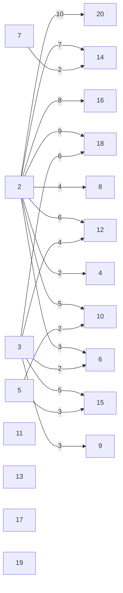

# 线性筛
当我们发现 $p_{j}\mid i$ 的时候，如果继续循环向下筛

那么下一个数 $y=i\cdot p_{j+1}=(\dfrac{i}{p_{j}}p_{j+1})\cdot p_{j}$ 会被筛两次

于是我们跳过 $i\cdot p_{j+1}$ 这一次，用 $(\dfrac{i}{p_{j}}p_{j+1})$ 筛掉 $y$ 

例如当 $i=4,p_{j}=2$ 时，$y=i\cdot p_{j+1}=4\times 3=12$

而 $(\dfrac{i}{p_{j}}p_{j+1})p_{j}=(\dfrac{4}{2}\times 3)\times 2=6\times 2=12$

我们选择用 $6$ 而不是 $4$ 筛掉 $12$

# 埃氏筛

