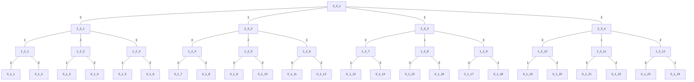
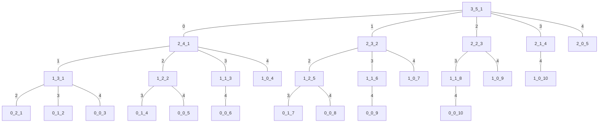
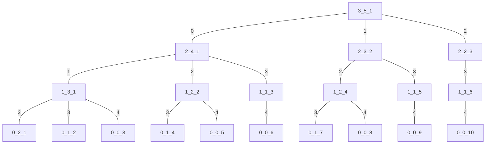

### 实现排列`dfs()`的时间复杂度
```cpp
int book[n], t[m], cnt;
void permute(int m, int n)
{
    cnt++;
    if (m == 0)
    {
        /*code*/
        return;
    }
    for (int i = 0; i < n; i++)
        if (book[i] == 0)
        {
            t[m] = i;
            book[i] = 1;
            permute(m - 1, n);
            book[i] = 0;
        }
}
```
`permute()`功能是求解数列$\{0,1,\cdots,n-1\}$的所有长度为 $m$ 的排列，`cnt`为时间总代价
**该算法时间复杂度为$O(\sum_{i=0}^m A_n^i)$**
>证明：
打印`permute(3,4)`的递归树
`m_n_cnt = permute(m, n)`

>设$T(m,n)$为`permute(m,n)`的运行时间
可得递归式$T(m,n)=\Big\{\begin{matrix} 0,m=0 \\ nT(m-1,n-1)+\Theta(n),m>0且m \in \mathbb{Z} \end{matrix}$
重写为$T(m,n)=\Big\{\begin{matrix} 0,m=0 \\ nT(m-1,n-1)+cn,m>0且m \in \mathbb{Z} \end{matrix}$
其中$c$为一次调用函数的时间代价
设$T_i$为第$i$层时间代价和,则
$T_m=c\cdot n=c\cdot A_n^1$
$T_{m-1}=c\cdot n(n-1)=c\cdot A_n^2 \\ \cdots$
$T_i=c\cdot n(n-1)\cdots(n-i)=c\cdot A_n^i \\ \cdots$
$T_1=c\cdot n(n-1)\cdots(n-m+1)=c\cdot A_n^m$
$T_0=0$
加上主函数调用`permute(m,n)`时间$c=c\cdot A_n^0$
则:$T(n)=\sum_{i=1}^{m} T_i+c=c\cdot\sum_{i=1}^{m} A_n^i+c\cdot A_n^0=c\cdot\sum_{i=0}^{m} A_n^i$
即:时间复杂度为$O(\sum_{i=0}^m A_n^i)$
### 实现组合`dfs()`的时间复杂度
* 算法1
```cpp
int book[n], t[m], cnt;
void combine(int k, int m, int n, int st)
{
    cnt++;
    if (k == 0)
    {
        /*code*/
        return;
    }
    for (int i = st; i < n; i++)
        if (book[i] == 0)
        {
            t[k] = i;
            book[i] = 1;
            combine(k - 1, m, n, i + 1);
            book[i] = 0;
        }
}
```
`combine()`功能是求解数列$\{0,1,\cdots,n-1\}$的所有长度为 $m$ 的组合，`cnt`为时间总代价
**该算法时间复杂度为$O(\sum_{i=0}^m C_n^i)$**
>证明：
打印`combine(0,3,5,0)`的递归树
`k_st_cnt = combine(k, m, n, st)`

>设$T(m,n)$为`combine(m,n)`的运行时间
可得递归式$T(m,n)=\Big\{\begin{matrix} 0,m=0或n=0 \\ \sum_{i=1}^nT(m-1,n-i)+\Theta(n),m>0且m \in \mathbb{Z} \end{matrix}$
重写为$T(m,n)=\Big\{\begin{matrix} 0,m=0或n=0 \\ \sum_{i=1}^nT(m-1,n-i)+cn,m>0且m \in \mathbb{Z} \end{matrix}$
其中$c$为一次调用函数的时间代价
设$T_i$为第$i$层时间代价和,则
$T_m=c\cdot n=c\cdot f(n,1)$
$T_{m-1}=c\cdot(1+2+3+\cdots+n-1)=c\cdot f(n-1,2)$
$T_{m-2}=c\cdot(1+3+6+\cdots+\frac{(n-1)(n-2)}{2})=c\cdot f(n-2,3) \\ \cdots$
$T_i=c\cdot f(n-m+i,m+1-i) \\ \cdots$
$T_1=c\cdot f(n-m+1,m)$
加上主函数调用`permute(m,n)`时间$c=c\cdot f(n+1,0)$
则:$T(n)=\sum_{i=1}^{m} T_i+c=c\cdot\sum_{i=1}^{m} f(n-m+i,m+1-i)+c\cdot f(n+1,0) \\=c\cdot\sum_{i=1}^{m+1} f(n-m+i,m+1-i) = c\cdot\sum_{i=0}^m f(n-i+1,i)(换元)=c\cdot\sum_{i=0}^m C_n^i$
即:时间复杂度为$O(\sum_{i=0}^m C_n^i)$
* 算法2
考虑到算法1生成的组合数列都是严格单调的，不难发现有这样一个事实：
对于数列$\{t_i\}$，$t_i$ 项可取区间小于等于$[i,n-1]$，可以**压缩为$[i,n-m+i]$**
>证明：
由于我们只求该区间的下界，所以选择`permute(m,n)`所生成的**字典序最大**的组合$\{n-m,n-m+1,\cdots,n-2,n-1\}$
故第$i$项可取区间为$[i,n-m+i](i\in[0,m-1])$，**区间长度为定值$=n-m+i-i+1=n-m+1$**   
```cpp
int book[n], t[m], cnt;
void combine(int k, int m, int n, int st)
{
    cnt++;
    if (k == 0)
    {
        /*code*/
        return;
    }
    for (int i = st; i <= n - k; i++)
        if (book[i] == 0)
        {
            t[k] = i;
            book[i] = 1;
            combine(k - 1, m, n, i + 1);
            book[i] = 0;
        }
}
```
在这段代码中，`combine()`功能是求解数列$\{0,1,\cdots,n-1\}$的所有长度为 $m$ 的组合，`cnt`为时间总代价
**该算法时间复杂度为$O(C_{n+1}^m)$**
>证明：
打印`combine(0,3,5,0)`的递归树
`k_st_cnt = combine(k, m, n, st)`

>设$T(m,n)$为`combine(m,n)`的运行时间
可得递归式$T(m,n)=\Big\{\begin{matrix} 0,m=0 \\ \sum_{i=1}^{n-m+1}T(m-1,n-i)+\Theta(n-m+1),m>0且m \in \mathbb{Z} \end{matrix}$
重写为$T(m,n)=\Big\{\begin{matrix} 0,m=1 \\ \sum_{i=1}^{n-m+1}T(m-1,n-i)+c(n-m+1),m>0且m \in \mathbb{Z} \end{matrix}$
其中$c$为一次调用函数的时间代价
设$T_i$为第$i$层时间代价和,则
$T_m=c\cdot(n-m+1)=c\cdot f(n-m+1,1)$
$T_{m-1}=c\cdot(1+2+3+\cdots+n-m+1)=c\cdot f(n-m+1,2)$
$T_{m-2}=c\cdot(1+3+6+\cdots+\frac{(n-m+2)(n-m+1)}{2})=c\cdot f(n-m+1,3)\\ \cdots$
$T_i=c\cdot f(n-m+1,m+1-i) \\ \cdots$
$T_1=c\cdot f(n-m+1,m)$
加上主函数调用`permute(m,n)`时间$c=c\cdot f(n-m+1,0)$
则:$T(m,n)=\sum_{i=1}^{m} T_i+c=c\cdot\sum_{i=1}^{m} f(n-m+1,m+1-i)+c\cdot f(n-m+1,0) \\ = c\cdot\sum_{i=1}^{m+1} f(n-m+1,m+1-i) = c\cdot\sum_{i=0}^m f(n-m+1,i) = f(n-m+2,m) = C_{n+1}^{n+1-m} = C_{n+1}^m$
即:时间复杂度为$O(C_{n+1}^m)$
