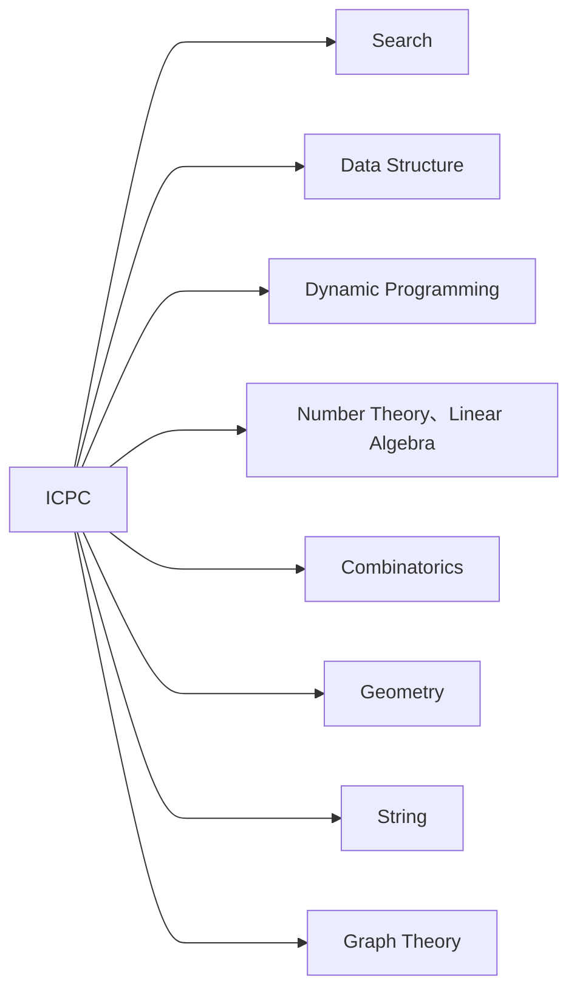

# ICPC 常用算法模板




# 目录

[TOC]

# 基本算法

## 尺取法/双指针

$O(n)$

```cpp
// 尺取法获取第k近的点下标
void getKth(int k) {
    int l = 1, r = k + 1;
    nxt[1] = k + 1;
    for (int i = 2; i <= n; i++) {
        while (r + 1 <= n && a[i] - a[l] > a[r + 1] - a[i])
            l++, r++;
        if (a[i] - a[l] < a[r] - a[i])
            nxt[i] = r;
        else
            nxt[i] = l;
    }
}
```

## 二分和二分答案

$O(\log n)$

```cpp
int l, r; // [l,r)
while (r - l > 1)
	if (int m = (l + r) / 2; check(m))
		l = m;
	else
		r = m;
// l : last true
// r : first false
/*
lower_bound(x) | check(x) : <x | r
upper_bound(x) | check(x) : >x | r
*/
```

## 倍增

### 快速幂式

$O(n\log m)$

```cpp
// n个点跳跃m次位置
vector<ll> f(nxt);
for (; m; m >>= 1) {
    if (m & 1)
        for (int i = 1; i <= n; i++)
            ans[i] = f[ans[i]]; //从上次的位置接着跳
    vector<ll> ff(f);
    for (int i = 1; i <= n; i++)
        f[i] = ff[ff[i]]; //倍增跳
}
```

### 朴素式

$O(n\log m)$

```cpp
// 初始化
vector<vector<ll>> f(n + 1, vector<ll>(__lg(m) + 2));
for (int i = 1; i <= n; i++)
    f[i][0] = nxt[i];
for (int t = 1; t <= __lg(m) + 1; t++)
    for (int i = 1; i <= n; i++)
        f[i][t] = f[f[i][t - 1]][t - 1];
// 查询
int p = 1;
for (int t = __lg(m) + 1; t >= 0; t--)
	if (f[p][t] is 合法) {
        p = f[p][t];
        其他操作
    }
```

## 前缀和与差分

### 一维

前缀和: $pr_i = pr_{i-1}+a_i$

差分: $df_i=a_i-a_{i-1}$

差分区间修改:

$$
\mathrm{add}(l,r,k)\to 
\begin{cases}
df_l\gets df_l+k\\
df_{r+1}\gets df_{r+1}-k
\end{cases}
$$


### 二维

前缀和: $pr_{i,j}=pr_{i,j-1}+pr_{i-1,j}-pr_{i-1,j-1}+a_{i,j}$

差分: $df_{i,j}=a_{i,j}-a_{i-1,j}-a_{i,j-1}+a_{i-1,j-1}$

差分区间修改:

$$
\mathrm{add}((x_1,y_1),(x_2,y_2),k)\to 
\begin{cases}
df_{x_1,y_1}\gets df_{x_1,y_1}+k \\
df_{x_1,y_2+1}\gets df_{x_1,y_2+1}-k\\
df_{x_2+1,y1}\gets df_{x_2+1,y1}-k\\
df_{x_2+1,y_2+1}\gets df_{x_2+1,y_2+1}+k
\end{cases}
$$


### 高维

前缀和: 

- 容斥原理:

$$
\mathop{\mathrm{for}}\limits_{s\in U}\ pr_{s}=a_{s}+\sum\limits_{r=\underbrace{00\cdots 01}_{n}}^{\overbrace{11\cdots 11}^{n}} (-1)^{\mathrm{popcount}(r)+1}pr_{s-r}，s-r 表示按位减
$$


- SOS DP:

$$
\mathop{\mathrm{for}}\limits_{i=1}^{n}\ \mathop{\mathrm{for}}\limits_{s\in U}\ pr_s\gets pr_s+pr_r， r\gets s,r_i\gets r_i-1
$$


- 对于每一维度空间都是2的情况，有

$$
\mathop{\mathrm{for}}\limits_{i=1}^{n}\ \mathop{\mathrm{for}}\limits_{s\in U}\ pr_s\gets pr_s+pr_{s\oplus (1<<i)}\ \mathrm{if}\ s_i=1
$$


差分:

$$
\mathop{\mathrm{for}}\limits_{s\in U}\ df_{s}=a_{s}+\sum\limits_{r=\underbrace{00\cdots 01}_{n}}^{\overbrace{11\cdots 11}^{n}} (-1)^{\mathrm{popcount}(r)}a_{s-r}
$$

### 树上

前缀和: 设 $pr_i$ 表示结点 $i$ 到根节点的权值总和。

- 若是点权， $x,y$ 路径上的和为 $pr_x + pr_y - pr_{lca} - pr_{fa(lca)}$。
- 若是边权， $x,y$ 路径上的和为 $pr_x + pr_y - 2\cdot pr_{lca}$。

差分: 

对于一次 $\delta(s,t)$ 的访问

- 点差分:

$$
\begin{cases}
d_s\gets d_s+1\\
d_{lca}\gets d_{\textit{lca}}-1\\
d_t\gets d_t+1\\
d_{fa(lca)}\gets d_{fa(lca)}-1\\
\end{cases}
$$

- 边差分:

$$
\begin{cases}
d_s\gets d_s+1\\
d_t\gets d_t+1\\
d_{lca}\gets d_{lca}-2\\
\end{cases}
$$


## 离散化

$a\{1,10,100,1000\}\to a\{1,2,3,4\},d\{1,10,100,1000\}$

将 ${a_i}$ 数组离散化，逆映射保存在 $d_i$ 中。$d[{a_i}']\to a_i$

$O(n\log n)$

```cpp
int compress(vector<pii> &a, vector<int> &d) {
    for (auto &[l, r] : a)
        d.push_back(l), d.push_back(r);
    sort(d.begin(), d.end());
    d.erase(unique(d.begin(), d.end()), d.end());
    auto get = [&d](int x) { return lower_bound(d.begin(), d.end(), x) - d.begin(); };
    for (auto &[l, r] : a)
        l = get(l), r = get(r);
    return d.size();
}
// 离散后修改
vector<int> f(compress(a, d));
for (auto &[l, r] : a)
    fill(f.begin() + l, f.begin() + r, 1);
// 逆映射到离散前的原数值
for (int i = 0; i < f.size() - 1; i++)
    if (f[i])
        ans += d[i + 1] - d[i];
```

二维的可以对两个维度分别离散化

## 排列和组合枚举

### 全排列 

$O(n!)$

```cpp
vector<int> a(n);
iota(a.begin(), a.end(), 1);
do {
    // 判断排列的合法性
} while (next_permutation(a.begin(), a.end()));
```

### 组合

$O(2^n)$

```cpp
int n = 4;
vector<int> a(n + 1);
for (int i = 0; i < (1 << n); i++) {
    int cnt = __builtin_popcount(i);
    a[cnt]++;
    for (int j = 0; j < n; j++)
        if (i >> j & 1) {
            // 判断某位
        }
}
for (int i = 0; i <= n; i++)
    cout << a[i] << " ";
```

# 数据结构

## 单调栈

**维护某值的左边第一大，右边第一大** $O(n)$

```cpp
stack<int> s;
for (int i = 0; i < n; i++) {
    while (!s.empty() && a[s.top()] < a[i]) {// 单调递减栈
        // 此时a[i]是右边第一个 > a[s.top()]的数
        s.pop();
    }
    // 此时a[i]左边有 s.size() 个 >= a[i] 的数
    // 此时a[s.top()]是左边第一个 >= a[i]的数
    s.push(i);
}
```

## 单调队列

**维护k区间最值** $O(n)$

```cpp
deque<int> q;
for (int i = 0; i < n; i++) {
    while (!q.empty() && i - q.front() >= k) // 调整覆盖范围
        q.pop_front();
    while (!q.empty() && a[q.back()] < a[i]) // 保持单调递减
        q.pop_back();
    q.push_back(i);
    if (i >= k - 1)
        cout << a[q.front()] << endl; // 区间[i-k+1,i]最大值
}
```

## ST表/稀疏表/Sparse Table

**维护区间最值**

预处理: $O(n\log n)$

查询: $O(1)$

```cpp
template <typename T, T (*op)(T, T)> struct SparseTable {
    int n, logn;
    vector<vector<T>> dat;
    SparseTable(const vector<T> &v) : n(v.size()), logn(__lg(n) + 1), dat(n + 1, vector<T>(logn + 1)) {
        for (int i = 1; i <= n; i++)
            dat[i][0] = v[i - 1];
        for (int j = 1; j <= logn; j++)
            for (int i = 1; i + (1 << j) - 1 <= n; i++)
                dat[i][j] = op(dat[i][j - 1], dat[i + (1 << j - 1)][j - 1]);
    }
    T query(int l, int r) {
        int s = __lg(r - l + 1);
        return op(dat[l][s], dat[r - (1 << s) + 1][s]);
    }
};
int maxn(int a, int b) { return a > b ? a : b; }
```

## 并查集

**维护集合的合并与查询是否相交**

初始化: $O(n)$

查询/合并: $O(\log n)$

```cpp
struct DisjointSet {
    vector<int> p;
    DisjointSet(int n = 1e6) : p(n) { iota(p.begin(), p.end(), 0); }
    int find(int x) { return x == p[x] ? x : p[x] = find(p[x]); }
    void merge(int x, int y) { p[find(y)] = find(x); }
};
```

## 树状数组

维护具有**区间减**性质的序列

单点修改: $O(\log n)$

区间查询: $O(\log n)$ 

```cpp
template <typename T> struct BIT {
    int size;
    vector<T> dat;
    BIT(int n = 0) : size(n), dat(n + 1, 0) {}
    inline int lowbit(int x) { return x & -x; }
    void add(int i, T x) {
        for (; i <= size; i += lowbit(i))
            dat[i] += x;
    }
    T get(int i) {
        T res = 0;
        for (; i; i -= lowbit(i))
            res += dat[i];
        return res;
    }
    T query(int l, int r) { return get(r) - get(l - 1); }
};
```

## 线段树

维护“满足**幺半群**（封闭性；结合律；幺元）的性质的信息”的序列

如区间和、区间积、区间最大/小值、区间异或等可合并信息

### zkw线段树

非递归实现，常数小，功能有限。

初始化建树: $O(n)$

单点修改: $O(\log n)$

区间查询: $O(\log n)$

```cpp
template <typename T, T (*op)(T, T), T (*e)()> class SegmentTree {
    int n;
    vector<T> dat;
    int bit_ceil(int n) { return 1 << 32 - __builtin_clz(n - 1); }

  public:
    SegmentTree(const int _n) : n(bit_ceil(_n)), dat(n << 1, e()) {}
    SegmentTree(const vector<T> &v) : n(bit_ceil(v.size())), dat(n << 1, e()) {
        copy(v.begin(), v.end(), dat.begin() + n);
        for (int p = n - 1; p; p--)
            dat[p] = op(dat[p << 1], dat[p << 1 | 1]);
    }
    void update(int i, T k) { // update[i]=k
        for (dat[i += n] = k; i; i >>= 1)
            dat[i >> 1] = op(dat[i], dat[i ^ 1]);
    }
    T query(int i, int j) { // query[i,j]
        T res = e();
        for (i += n, j += n; i <= j; i >>= 1, j >>= 1) {
            res = i & 1 ? op(res, dat[i++]) : res;
            res = j & 1 ? res : op(res, dat[j--]);
        }
        return res;
    }
};
template <typename T> T Add(T a, T b) { return a + b; }
template <typename T> T e() { return 0; }
```

### 线段树

结构体实现，可扩展性强；lazy-tag 延迟更新。

维护 `operator+` `pushup` `mark` `pushdown`  实现区间信息合并、标记与下传。

初始化建树: $O(n)$

区间修改: $O(\log n)$

区间查询: $O(\log n)$

```cpp
template <typename T> class SegmentTree {
    struct Node {
        T dat = 0, tag = 0;
        Node operator+(const Node &t) { return Node{dat + t.dat, 0}; }
    };
    int n;
    vector<Node> tr;
    vector<int> l, r;
    int bCeil(int n) { return 1 << 32 - __builtin_clz(n - 1); }
    void pushup(int p) { tr[p] = tr[p << 1] + tr[p << 1 | 1]; }
    void mark(T k, int p) {
        tr[p].dat += (r[p] - l[p] + 1) * k;
        tr[p].tag += k;
    }
    void pushdown(int p) {
        if (tr[p].tag) {
            mark(tr[p].tag, p << 1);
            mark(tr[p].tag, p << 1 | 1);
            tr[p].tag = 0;
        }
    }

  public:
    SegmentTree(vector<T> &v) : n(bCeil(v.size())), tr(n << 1), l(n << 1), r(n << 1) {
        for (int p = n, i = 0; i < v.size(); i++, p++)
            tr[p].dat = v[i];
        for (int p = 2 * n - 1, i = n, d = 1; p; i >>= 1, d <<= 1)
            for (int j = i - 1; j >= 0; j--, p--) {
                l[p] = j * d + 1, r[p] = (j + 1) * d;
                if (p < n)
                    pushup(p);
            }
    }
    void update(int a, int b, T k, int p = 1) {
        if (r[p] < a || b < l[p])
            return;
        if (a <= l[p] && r[p] <= b)
            return mark(k, p);
        pushdown(p);
        update(a, b, k, p << 1);
        update(a, b, k, p << 1 | 1);
        pushup(p);
    }
    Node query(int a, int b, int p = 1) {
        if (r[p] < a || b < l[p])
            return Node();
        if (a <= l[p] && r[p] <= b)
            return tr[p];
        pushdown(p);
        Node vl = query(a, b, p << 1);
        Node vr = query(a, b, p << 1 | 1);
        return vl + vr;
    }
};
```

### 可持久化线段树/主席树

查询区间第 $k$ 小: $O(m\log n)$

```cpp
#include <bits/stdc++.h>
using namespace std;
const int N = 2e5 + 5;
int cnt = 0;
int a[N], b[N], root[N];
struct Node {
    int l, r, sum;
} tree[N << 5];

int update(int pre, int pl, int pr, int k) {
    int rt = ++cnt;
    tree[rt].l = tree[pre].l;
    tree[rt].r = tree[pre].r;
    tree[rt].sum = tree[pre].sum + 1;
    if (pl == pr)
        return rt;
    int mid = (pl + pr) >> 1;
    if (k <= mid)
        tree[rt].l = update(tree[pre].l, pl, mid, k);
    else
        tree[rt].r = update(tree[pre].r, mid + 1, pr, k);
    return rt;
}
int query(int u, int v, int pl, int pr, int k) {
    if (pl == pr)
        return pl;
    int x = tree[tree[v].l].sum - tree[tree[u].l].sum;
    int mid = (pl + pr) >> 1;
    if (k <= x)
        return query(tree[u].l, tree[v].l, pl, mid, k);
    else
        return query(tree[u].r, tree[v].r, mid + 1, pr, k - x);
}
int main() {
    int n, m;
    cin >> n >> m;
    for (int i = 1; i <= n; i++) {
        cin >> a[i];
        b[i] = a[i];
    }

    sort(b + 1, b + 1 + n);
    int size = unique(b + 1, b + 1 + n) - (b + 1);
    for (int i = 1; i <= n; i++)
        a[i] = lower_bound(b + 1, b + 1 + size, a[i]) - b;

    for (int i = 1; i <= n; i++) {
        root[i] = update(root[i - 1], 1, size, a[i]);
    }
    while (m--) {
        int x, y, k;
        cin >> x >> y >> k;
        int t = query(root[x - 1], root[y], 1, size, k);
        cout << b[t] << endl;
    }
    return 0;
}
```

## 分块与莫队算法

### 分块

```cpp
template <typename T> class Block {
    int n, t, m;
    vector<int> l, r, id;
    vector<T> &v, sum, tag;
    void add(int p, int a, int b, T k) {
        sum[p] += k * (b - a + 1);
        for (int i = a; i <= b; i++)
            v[i] += k;
    }
    T ask(int p, int a, int b) {
        T res = tag[p] * (b - a + 1);
        for (int i = a; i <= b; i++)
            res += v[i];
        return res;
    }

  public:
    Block(vector<T> &v) // 1-index
        : n(v.size() - 1), t(sqrt(n)), m(n / t + (n % t > 0)), l(m + 1), r(m + 1), id(n + 1),
    	  v(v), sum(m + 1), tag(m + 1) {
        for (int i = 1; i <= m; i++) {
            l[i] = (i - 1) * t + 1, r[i] = min(i * t, n);
            for (int j = l[i]; j <= r[i]; j++) {
                sum[i] += v[j];
                id[j] = (j - 1) / t + 1;
            }
        }
    }
    void update(int a, int b, T k) {
        int p = id[a], q = id[b];
        if (p == q) {
            add(p, a, b, k);
        } else {
            for (int i = p + 1; i <= q - 1; i++)
                tag[i] += k;
            add(p, a, r[p], k);
            add(q, l[q], b, k);
        }
    }
    T query(int a, int b) {
        T res = 0;
        int p = id[a], q = id[b];
        if (p == q) {
            res += ask(p, a, b);
        } else {
            for (int i = p + 1; i <= q - 1; i++)
                res += sum[i] + tag[i] * (r[i] - l[i] + 1);
            res += ask(p, a, r[p]);
            res += ask(q, l[q], b);
        }
        return res;
    }
};
```

## 二叉搜索树&平衡树

# 图论

## 存图

### 邻接表/邻接矩阵

```cpp
using Node = pair<int, int>;
vector<int> G[N];
int G[N][N]; //
int n, m;

for (int i = 0; i < m; i++) {
    int u, v, w;
    cin >> u >> v >> w;
    G[u].push_back({v, w});
    G[v].push_back({u, w});
    G[u][v] = G[v][u] = w;
}
for (int u = 0; u < n; u++)
    for (auto &[v, w] : G[u]) {}
	for (int v = 0; v < n; v++) if (G[u][v]) {}
```

### 链式前向星

```cpp
struct ChainForwardStar {
    using Edge = pair<int, int>;
    vector<int> head, next;
    vector<Edge> edges;
    int E;
    ChainForwardStar(int V = 0) { head.resize(V + 1, -1); }
    void addEdge(int u, int v, int w = 1) {
        edges.push_back({v, w});
        next.push_back(head[u]);
        head[u] = E++;
    }
};
ChainForwardStar G(n);
for (int i = 0; i < m; i++) {
    int u, v, w;
    cin >> u >> v >> w;
    G.addEdge(u, v, w);
}
for (int u = 0; u < n; u++)
    for (int i = G.head[u]; ~i; i = G.next[i]) {
        auto &[v, w] = G.edges[i];
        cout << u << " " << v << " " << w << endl;
    }
```

## DFS/BFS

$O(n)$

```cpp
void dfs(int u) {
    if (vis[u])
        return;
    vis[u] = true;
    for (int v : G[u])
        dfs(v);
}
void bfs(int u) {
    queue<int> Q;
    vis[u] = true;
    Q.push(u);
    while (!Q.empty()) {
        int u = Q.front();
        Q.pop();
        for (int v : G[u])
            if (!vis[v]) {
                vis[v] = true;
                Q.push(v);
            }
    }
}
```

## 拓扑排序

$O(n)$

```cpp
vector<int> ans;
queue<int> q;
int indeg[N];

bool tsort() {
    queue<int> q;
    vector<int> ans;
    for (int u = 1; u <= n; u++)
        for (int v : G[u])
            indeg[v]++;
    for (int u = 1; u <= n; u++)
        if (indeg[u] == 0)
            q.push(u);
    while (!q.empty()) {
        int u = q.front();
        q.pop();
        ans.push_back(u);
        for (int v : G[u])
            if (--indeg[v] == 0)
                q.push(v);
    }
    return ans.size() == n;
}
```

## 最短路径

### Dijkstra

朴素算法: $O(n^2)$

堆优化: $O(m\log n)$

```cpp
int dist[N];
bool vis[N];

void dijkstra(int s) {
    memset(0, 0x3f, sizeof(dist));
    dist[s] = 0;
    while (true) {
        int u = -1;
        for (int i = 0; i < V; i++)
            if ((u == -1 || dist[u] > dist[i]) && !vis[i])
                u = i;
        if (u == -1)
            break;
        vis[u] = true;
        for (auto &[v, w] : G[u])
            dist[v] = min(dist[v], dist[u] + w);
    }
}
void dijkstra_heap(int s) {
    priority_queue<Node, vector<Node>, greater<Node>> q;
    memset(0, 0x3f, sizeof(dist));
    dist[s] = 0;
    q.push({0, s});
    while (!q.empty()) {
        auto [dist_u, u] = q.top();
        q.pop();
        if (dist[u] < dist_u)
            continue;
        for (auto &[v, w] : G[u])
            if (dist[v] > dist[u] + w)
                q.push({dist[v] = dist[u] + w, v});
    }
}
```

## 最小生成树

### kurskal

$O(m\log m)$

```cpp
vector<int> p;
int find(int x) { return x == p[x] ? x : p[x] = find(p[x]); }

int kruskal() {
    int sum = 0, cnt = 0;
    p.resize(V + 1);
    iota(p.begin(), p.end(), 0);
    sort(edges.begin(), edges.end());
    for (auto &[u, v, w] : edges)
        if (find(u) != find(v)) {
            sum += w;
            cnt++;
            p[find(u)] = find(v);
        }
    return cnt == V - 1 ? sum : -1;
}
```

# 数学


# 字符串

## Tire/字典树

```cpp
struct Tire {
    int nxt[100000][26], cnt;
    bool exist[100000]; // 该结点结尾的字符串是否存在

    void insert(string s) { // 插入字符串
        int p = 0;
        for (char c : s) {
            c -= 'a';
            if (!nxt[p][c])
                nxt[p][c] = ++cnt; // 如果没有，就添加结点
            p = nxt[p][c];
        }
        exist[p] = 1;
    }

    bool find(string s) { // 查找字符串
        int p = 0;
        for (char c : s) {
            c -= 'a';
            if (!nxt[p][c])
                return false;
            p = nxt[p][c];
        }
        return exist[p];
    }
};
```

