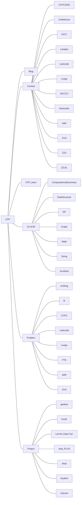

This is all source code written by Tanphoon.

`Blog` for backup blog.

`Contest` for saving the source code when participating in online and offline competitions.

`CPP_learn` for saving examples when learning C++.

`OI-ACM` for saving exercises and templates for learning algorithms.

`Problem` for saving the practice questions of each OJ.

`Project` for saving interesting small projects that are usually written down.

