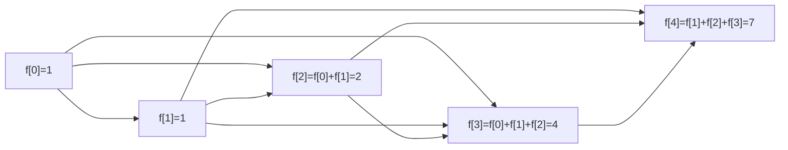
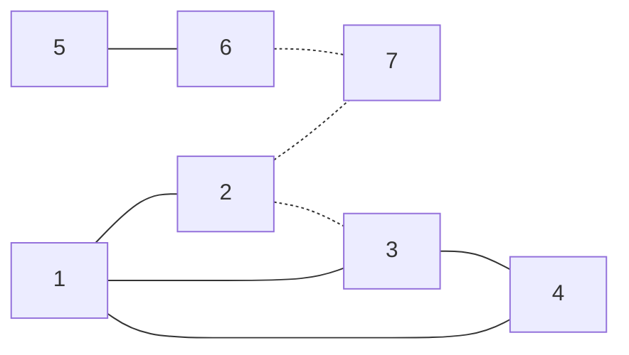
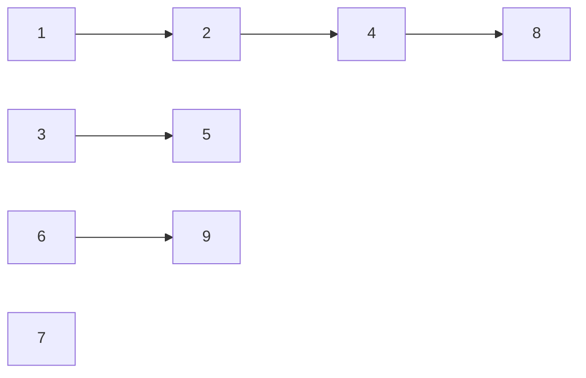

### 7-1 [走楼梯升级版](https://pintia.cn/problem-sets/1584715421307510784/problems/1584715421366231040)

##### 考察：递推

> 走楼梯升级版，你前面有n（n>=1）级阶梯，你一次可以走1级阶梯，也可以一次走2级阶梯，还可以1次走三级阶梯，请问n级阶梯的走法有多少种？

简单列举一下前几阶楼梯的走法，我们可以得出这样一个递推公式 ：

$f[i]=f[i-1]+f[i-2]+f[i-3]$ ， $f[i]$ 为第 $i$ 阶楼梯的走法种数

为了节省空间，可以使用四个`ll`类型迭代保存。题目与斐波那契数列类似



```cpp
#include <bits/stdc++.h>
using namespace std;
using ll = long long;
using vi = vector<ll>;

int main()
{
    ll n;
    cin >> n;
    vi f{1, 1, 2, 4};
    if (n < 4)
        return cout << f[n], 0;
    for (ll i = 4; i <= n; i++)
    {
        for (int i = 0; i < 3; i++)
            f[i] = f[i + 1];
        f[3] = f[2] + f[1] + f[0];
    }
    cout << f[3] << endl;
    return 0;
}
```

### 7-2 [快速幂](https://pintia.cn/problem-sets/1584715421307510784/problems/1584715421366231041)

##### 考察：递推

模板题，刘老师钉钉课讲过。题目没说取模就不用取了

```cpp
#include <bits/stdc++.h>
using namespace std;
using ll = long long;
ll pow(ll x, ll n)
{
    ll s = 1;
    for (; n; n >>= 1, x = x * x)
        if (n & 1)
            s = s * x;
    return s;
}
int main()
{
    ll a, b;
    while(cin >> a >> b)
        cout << pow(a, b) << endl;
    return 0;
}
```

### 7-3 [排座位](https://pintia.cn/problem-sets/1584715421307510784/problems/1584715421366231042)

##### 考察：并查集



题目样例如图，实线边表示朋友，虚线边表示敌人

题目定义，朋友的朋友是朋友，所有用实线边连接节点都是朋友关系，可以用**并查集**维护

在同一集合内（是朋友），有敌对关系的输出`OK but...`，没有的输出`No problem`

在集合外（不是朋友），直接与集合内某点有敌对关系的输出`way`，没有的输出`OK`

```cpp
#include <bits/stdc++.h>
using namespace std;
using vi = vector<int>;
using vvi = vector<vi>;
const int N = 1e2 + 5, INF = 0x3f3f3f3f;
int p[N];
void init() { iota(p, p + N, 0); }
int find(int x) { return x == p[x] ? x : p[x] = find(p[x]); }
void merge(int x, int y) { find(x) != find(y) ? p[find(x)] = find(y) : 0; }
void solve()
{
    int n, m, k;
    cin >> n >> m >> k;
    vvi G(n + 1, vi(n + 1, INF));
    for (int i = 0, u, v, w; i < m; i++)
    {
        cin >> u >> v >> w;
        if (w == 1)
            merge(u, v);
        else if (w == -1)
            G[u][v] = G[v][u] = -1;
    }
    while (k--)
    {
        int u, v;
        cin >> u >> v;
        if (find(u) == find(v))
            if (G[u][v] != -1)
                cout << "No problem";
            else
                cout << "OK but...";
        else if (G[u][v] == -1)
            cout << "No way";
        else
            cout << "OK";
        cout << endl;
    }
}
int main()
{
    ios::sync_with_stdio(0), cin.tie(0), cout.tie(0);
    init();
    solve();
    return 0;
}
```

### 7-4 [ 求前缀表达式的值](https://pintia.cn/problem-sets/1584715421307510784/problems/1584715421366231043)

##### 考察：模拟，栈

> 对于一个前缀表达式的求值而言，首先要从右至左扫描表达式，从右边第一个字符开始判断，如果当前字符是数字则一直到数字串的末尾再记录下来，如果是运算符，则将右边离得最近的两个“数字串”作相应的运算，以此作为一个新的“数字串”并记录下来。一直扫描到表达式的最左端时，最后运算的值也就是表达式的值。

可以使用左右两个栈，把数字和运算结果压右栈，左栈栈顶为运算符时运算。全部执行完左栈空，右栈剩下最终答案。

```cpp
#include <bits/stdc++.h>
using namespace std;

bool isOP(char c) { return (c == '+' || c == '-' || c == '*' || c == '/'); }
void solve()
{
    stack<string> sl;
    stack<double> sr;
    string s;
    double a, b;
    char op;
    while (cin >> s)
        sl.push(s);
    while (!sl.empty())
    {
        // sl栈顶是运算符，直接运算
        if (sl.top().size() == 1 && isOP(sl.top()[0]))
        {
            // 可以运算
            if (sr.size() >= 2)
            {
                a = sr.top(), sr.pop();
                b = sr.top(), sr.pop();
                op = sl.top()[0], sl.pop();
                if (op == '+') sr.push(a + b);
                else if (op == '-') sr.push(a - b);
                else if (op == '*') sr.push(a * b);
                else if (b != 0) sr.push(a / b);
                else return void(cout << "ERROR");
            }
            // 表达式错误
            else return void(cout << "ERROR");
        }
        // sl栈顶是数字，移到sr中
        else sr.push(stod(sl.top())), sl.pop(); // stod()  c++11函数 string转double
    }
    // 表达式错误，数字多了
    if (sr.size() != 1)
        cout << "ERROR";
    else
        printf("%.1lf", sr.top());
}
int main()
{
    solve();
    return 0;
}
```

### 7-5 [ 列车调度](https://pintia.cn/problem-sets/1584715421307510784/problems/1584715421366231044)

##### 考察：贪心，二分

为了列车按序号递减的顺序从出口离开，保证每个铁轨都是从左到右序号升序。

为了尽可能少使用铁轨，序号小的靠上放置，序号大的靠下放置，这样每个铁轨的最小序号满足从上到下升序。

如果列车均大于每个铁轨的最小序号，需使用新铁轨，否则使用二分查找从上到下第一个大于该序号的位置并插在铁轨后面



```c
#include <bits/stdc++.h>
using namespace std;
using vi = vector<int>;
#define all(v) v.begin(), v.end()

void solve()
{
    vi rail;
    int n, m, x;
    cin >> n;
    while (n--)
    {
        cin >> x;
        if (rail.size() == 0 || rail.back() < x)
            rail.push_back(x);
        else
            *upper_bound(all(rail), x) = x; // 查找第一个大于x的元素并返回地址
    }
    cout << rail.size();
}
int main()
{
    solve();
    return 0;
}
```

### 7-6 [lds的难题](https://pintia.cn/problem-sets/1584715421307510784/problems/1585009983901016064)

##### 考察：矩阵快速幂

题目里lds的蒟蒻舍友有提到这道题的方法——矩阵快速幂

朴素版本的快速幂，是计算整数的幂，稍微修改一下代码（乘号变加号）可以衍生出快速乘法

于是矩阵快速幂应运而生，将乘号扩展为矩阵乘，即可运算

根据递推式 $f[i]=f[i-1]+f[i-2]+f[i-3]$

设向量 $\alpha=(f_{i},f_{i-1},f_{i-2})^{\mathrm{T}}$ 和 $\beta=(f_{i-1},f_{i-2},f_{i-3})^{\mathrm{T}}$ 

求解一个矩阵 $A$ 使 $\alpha=A\beta$  即

$$
\begin{pmatrix}
f_{i}\\
f_{i-1}\\
f_{i-2}
\end{pmatrix} =\begin{bmatrix}
1 & 1 & 1\\
1 & 0 & 0\\
0 & 0 & 0
\end{bmatrix}\begin{pmatrix}
f_{i-1}\\
f_{i-2}\\
f_{i-3}
\end{pmatrix}
$$

所以

$$
A=\begin{bmatrix}
1 & 1 & 1\\
1 & 0 & 0\\
0 & 0 & 0
\end{bmatrix}
$$

根据矩阵的运算

$$
\begin{pmatrix}
f_{n}\\
f_{n-1}\\
f_{n-2}
\end{pmatrix}=A^{n-3}
\begin{pmatrix}
f_{3}\\
f_{2}\\
f_{1}
\end{pmatrix}=A^{n-3}
\begin{pmatrix}
4\\
2\\
1
\end{pmatrix}
$$

幂出现了，题目由 $n-3$ 次循环递推变成求矩阵的 $n-3$ 次幂

有了快速幂，可以将 $n-3$ 矩阵乘法变成 $\log_2(n-3)$ 次矩阵乘法

这道题的数据， $10^{16}$ 次循环变五十余次矩阵乘法

```c
#include <bits/stdc++.h>
using namespace std;
using ll = long long;
using vi = vector<ll>;
using matrix = vector<vi>;
const int mod = 114514;
// 重载*运算符，定义矩阵乘法
matrix operator*(matrix &A, matrix &B)
{
    int n = A.size(), l = B.size(), m = B[0].size();
    matrix C(n, vi(m));
    for (int i = 0; i < n; i++)
        for (int k = 0; k < l; k++)
            for (int j = 0; j < m; j++)
                C[i][j] = (C[i][j] + A[i][k] * B[k][j]) % mod;
    return C;
}
// 快速幂模板
matrix pow(matrix &A, ll n)
{
    matrix B(A.size(), vi(A[0].size()));
    // 单位1变成单位矩阵
    for (int i = 0; i < B.size(); i++)
        B[i][i] = 1;
    while (n)
    {
        if (n & 1)
            B = B * A;
        A = A * A;
        n >>= 1;
    }
    return B;
}
int main()
{
    ll n;
    matrix A{{1, 1, 1}, {1, 0, 0}, {0, 1, 0}}, res;
    matrix f{{4}, {2}, {1}}, fn;
    cin >> n;
    if (n < 4)
        return cout << f[3 - n][0], 0;
    res = pow(A, n - 3);
    fn = res * f;
    cout << fn[0][0];
    return 0;
}
```

扩展：更一般的，对于 $m$ 项递推式，如果记递推式为 $a_{n+m}=\sum\limits_{i=0}^{m-1} b_{i}a_{n+i}$

则可以把递推式写成如下矩阵形式加以矩阵快速幂计算

$$
\begin{pmatrix}
a_{n+m}\\
a_{n+m-1}\\
\vdots \\
a_{n+1}
\end{pmatrix} =\begin{bmatrix}
b_{m-1} & \cdots  & b_{1} & b_{0}\\
1 & \cdots  & 0 & 0\\
\vdots  & \ddots  & 0 & \vdots \\
0 & \cdots  & 1 & 0
\end{bmatrix}\begin{pmatrix}
a_{n+m-1}\\
a_{n+m-2}\\
\vdots \\
a_{n}
\end{pmatrix}
$$
