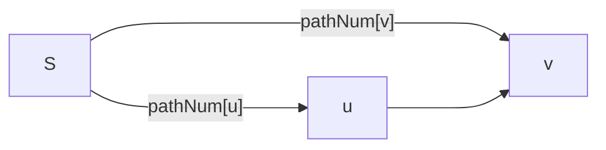

[TOC]

### 7-1 [ 还原二叉树](https://pintia.cn/problem-sets/1593235680073998336/problems/1593235680136912896)

- 二叉树的重建

```cpp
#include <bits/stdc++.h>
using namespace std;
int mx = 1;
char s1[55], s2[55];
void pan(int root, int star, int end, int depth) {
    if (star > end)
        return;
    mx = max(mx, depth);
    int i = star;
    while (s1[root] != s2[i]) {
        i++;
    }
    pan(root + 1, star, i - 1, depth + 1);
    pan(root + 1 + i - star, i + 1, end, depth + 1);
}
int main() {
    int n;
    cin >> n;
    cin >> s1 >> s2;
    pan(0, 0, n - 1, 1);
    cout << mx;
    return 0;
}
```

### 7-2 [朋友圈](https://pintia.cn/problem-sets/1593235680073998336/problems/1593235680136912897)

* 并查集

把朋友关系的两个人放入同一集合，统计不同集合内部元素个数

```cpp
#include <bits/stdc++.h>
using namespace std;

struct DisjointSet {
    vector<int> p;
    DisjointSet(int n = 1e9) : p(vector<int>(n)) { iota(p.begin(), p.end(), 0); }
    int find(int x) { return x == p[x] ? x : p[x] = find(p[x]); }
    void merge(int x, int y) { find(x) != find(y) ? p[find(y)] = find(x) : 0; }
};
signed main() {
    int n, m;
    cin >> n >> m;
    DisjointSet dset(n + 1);
    for (int i = 0; i < m; i++) {
        int k, x, y;
        cin >> k >> x;
        for (int j = 1; j < k; j++) {
            cin >> y;
            dset.merge(x, y);
        }
    }
    map<int, int> Map;
    for (int i = 1; i <= n; i++)
        Map[dset.find(i)]++;
    int ans = 0;
    for (auto it : Map)
        ans = max(ans, it.second);
    cout << ans << endl;
    return 0;
}
                    
```

### 7-3 [列出连通集](https://pintia.cn/problem-sets/1593235680073998336/problems/1593235680136912898)

- 深度优先遍历
- 广度优先遍历

模板题，只是加了一个路径存储

```cpp
#include <bits/stdc++.h>
using namespace std;
#define print(v) for (int i = 0; i < v.size(); cout << v[i] << "  "[++i == v.size()])

int V, E;
vector<vector<int>> G;
vector<int> vis, path;
void dfs(int u) {
    path.push_back(u);
    vis[u] = true;
    for (int v = 0; v < V; v++)
        if (G[u][v] && !vis[v])
            dfs(v);
}
void bfs(int u) {
    queue<int> q;
    q.push(u);
    while (!q.empty()) {
        u = q.front(), q.pop();
        path.push_back(u);
        vis[u] = true;
        for (int v = 0; v < V; v++)
            if (G[u][v] && !vis[v]) {
                q.push(v);
                vis[v] = true;
            }
    }
}
signed main() {
    cin >> V >> E;
    G.assign(V, vector<int>(V));
    vis.assign(V, 0);
    for (int i = 0; i < E; i++) {
        int u, v;
        cin >> u >> v;
        G[u][v] = G[v][u] = 1;
    }
    for (int u = 0; u < V; u++) 
        if (!vis[u]) {
            dfs(u);
            cout << "{ ";
            print(path);
            cout << "}" << endl;
            path.clear();
        }
    vis.assign(V, 0);
    for (int u = 0; u < V; u++)
        if (!vis[u]) {
            bfs(u);
            cout << "{ ";
            print(path);
            cout << "}" << endl;
            path.clear();
        }
    return 0;
}
```

### 7-4 [功夫传人](https://pintia.cn/problem-sets/1593235680073998336/problems/1593235680136912899)

* 广度优先遍历

为每个人构建一个节点，储存**是否为得道者**、**功力值**、**徒弟列表**

从祖师爷（根节点）开始广度优先遍历，把功力值传给徒弟，统计得道者的所得的功力即可

```cpp
#include <bits/stdc++.h>
using namespace std;
int V, E;
double Z, r, sum;
struct Node {
    int plus = 0;
    double s = 0;
    vector<int> son;
};
signed main() {
    cin >> V >> Z >> r;
    vector<Node> nodes(V);
    nodes[0].s = Z;
    for (int i = 0, k; i < V; i++) {
        cin >> k;
        if (k == 0) {
            cin >> nodes[i].plus;
        } else {
            nodes[i].son.assign(k, 0);
            for (int &x : nodes[i].son)
                cin >> x;
        }
    }
    queue<int> q;
    q.push(0);
    while (!q.empty()) {
        Node h = nodes[q.front()];
        q.pop();
        if (h.son.empty())
            sum += h.s * h.plus;
        for (int v : h.son) {
            nodes[v].s = h.s * (1 - r / 100.0);
            q.push(v);
        }
    }
    cout << int(sum);
    return 0;
}
```

### 7-5 [任务调度的合理性](https://pintia.cn/problem-sets/1593235680073998336/problems/1593235680136912900)

- 拓扑排序

模板题，如果任务调度合理，说明这是一个DAG（有向无环图），所有节点都能有拓扑序（`ans.size() == V`），否则不合理

```c
#include <bits/stdc++.h>
using namespace std;

int V, E;
vector<vector<int>> G;
vector<int> ans;

bool tsort() {
    vector<int> indeg(V + 1);
    queue<int> q;
    for (int u = 1; u <= V; u++)
        for (int v : G[u])
            indeg[v]++;
    for (int u = 1; u <= V; u++)
        if (indeg[u] == 0)
            q.push(u);
    while (!q.empty()) {
        int u = q.front();
        q.pop();
        ans.push_back(u);
        for (int v : G[u])
            if (--indeg[v] == 0)
                q.push(v);
    }
    return ans.size() == V;
}
signed main() {
    cin >> V;
    G.resize(V + 1);
    for (int v = 1, k; v <= V; v++) {
        cin >> k;
        for (int i = 0, u; i < k; i++)
            cin >> u, G[u].push_back(v);
    }
    cout << tsort() ? 1 : 0;
    return 0;
}
```

### 7-6 [公路村村通](https://pintia.cn/problem-sets/1593235680073998336/problems/1593235680136912901)

- 最小生成树kruskal算法

模板题， $V$ 个节点的图的生成树边数为 $V-1$ ，kruskal算法简单好写

使用c++17新特性**结构化绑定** `for (auto &[u, v, w] : edges)` 增加代码的可读性


```cpp
#include <bits/stdc++.h>
using namespace std;

struct Edge {
    int u, v, w;
    bool operator<(const Edge &t) { return w < t.w; }
};
int V, E;
vector<Edge> edges;
vector<int> p;
int find(int x) { return x == p[x] ? x : p[x] = find(p[x]); }

int kruskal() {
    int sum = 0, cnt = 0;
    p.resize(V + 1);
    iota(p.begin(), p.end(), 0);
    sort(edges.begin(), edges.end());
    for (auto &[u, v, w] : edges)
        if (find(u) != find(v)) {
            sum += w;
            cnt++;
            p[find(u)] = find(v);
        }
    return cnt == V - 1 ? sum : -1;
}
signed main() {
    cin >> V >> E;
    edges.resize(E);
    for (auto &[u, v, w] : edges)
        cin >> u >> v >> w;
    cout << kruskal();
    return 0;
}
```

### 7-7 [旅游规划](https://pintia.cn/problem-sets/1593235680073998336/problems/1593235680136912902)

- 单源最短路径dijkstra算法

根据题意，判断是否为最短路时有两个条件

1. 优先选择距离近的路线
2. 距离相同两种路线，选择花钱少的

```cpp
#include <bits/stdc++.h>
using namespace std;
const int INF = 0x3f3f3f3f;

struct Edge {
    int v, d, w;
};
int V, E, S, D;
vector<vector<Edge>> G;
vector<bool> vis;
vector<int> dist, cost;

void dijkstra(int s) {
    vis.assign(V, false);
    dist.assign(V, INF);
    cost.assign(V, INF);
    dist[s] = 0, cost[s] = 0;
    while (true) {
        int u = -1;
        for (int i = 0; i < V; i++)
            if ((u == -1 || dist[u] > dist[i]) && !vis[i])
                u = i;
        if (u == -1)
            break;
        vis[u] = true;
        for (auto &[v, d, w] : G[u])
            if (dist[v] > dist[u] + d) // 松弛操作，优先选择距离近的路线
            {
                dist[v] = dist[u] + d;
                cost[v] = cost[u] + w;
            } else if (dist[v] == dist[u] + d) //距离相同两种路线，选择花钱少的
                cost[v] = min(cost[v], cost[u] + w);
    }
}
int main() {
    cin >> V >> E >> S >> D;
    G.resize(V);
    for (int i = 0, u, v, d, w; i < E; i++) {
        cin >> u >> v >> d >> w;
        G[u].push_back({v, d, w});
        G[v].push_back({u, d, w});
    }
    dijkstra(S);
    cout << dist[D] << " " << cost[D];
    return 0;
}
```

### 7-8 [城市间紧急救援](https://pintia.cn/problem-sets/1593235680073998336/problems/1593235680136912903)

- 单源最短路径dijkstra算法

这道题较为复杂。判断最短路依旧两个条件

1. 尽快赶往事发地
2. 一路上召集尽可能多的救援队

难点在记录最短路条数



如果路径 $S-u\to v$ 和 $S-v$ 的距离相等，都是最短路，那么 `pathNum[v] += pathNum[u]`

```cpp
#include <bits/stdc++.h>
using namespace std;
using Node = pair<int, int>;
#define print(v) for (int i = 0; i < v.size(); cout << v[i] << " \n"[++i == v.size()])
const int INF = 0x3f3f3f3f;

int V, E, S, D;
vector<vector<Node>> G;
vector<bool> vis;
vector<int> help, dist, pre, pathNum, helpSum;
void dijkstra(int s) {
    vis.assign(V, false);
    dist.assign(V, INF), pre.assign(V, -1);
    pathNum.assign(V, 1), helpSum = help;
    dist[S] = 0;
    while (true) {
        int u = -1;
        for (int i = 0; i < V; i++)
            if ((u == -1 || dist[u] > dist[i]) && !vis[i])
                u = i;
        if (u == -1)
            break;
        vis[u] = true;
        for (auto &[v, w] : G[u])
            // 松弛操作，优先选择距离近的路线
            if (dist[v] > dist[u] + w) {
                dist[v] = dist[u] + w;
                pre[v] = u;
                pathNum[v] = pathNum[u];
                helpSum[v] = helpSum[u] + help[v];
            //新的路径和原最短路径长度相等，说明都是最短路，这时当前记录的最短路条数就要加上原来记录的这个长度的最短路条数
            } else if (dist[v] == dist[u] + w) {
                pathNum[v] += pathNum[u];
                //只有新的最短路的救援队数量比之前多时，才把路径信息更新成当前新的最短路的路径信息
                if (helpSum[v] < helpSum[u] + help[v]) {
                    helpSum[v] = helpSum[u] + help[v];
                    pre[v] = u;
                }
            }
    }
}
signed main() {
    cin >> V >> E >> S >> D;
    G.resize(V);
    help.resize(V);
    for (int i = 0; i < V; i++)
        cin >> help[i];
    for (int i = 0, u, v, w; i < E; i++) {
        cin >> u >> v >> w;
        G[u].push_back({v, w});
        G[v].push_back({u, w});
    }
    dijkstra(S);
    deque<int> ans;
    cout << pathNum[D] << " " << helpSum[D] << endl;
    for (int p = D; p != -1; p = pre[p])
        ans.push_front(p);
    print(ans);
    return 0;
}
```

### 7-9 [ 汉密尔顿回路](https://pintia.cn/problem-sets/1593235680073998336/problems/1593235680136912904)

根据hamilton回路的定义**找一个能遍历图中所有顶点的简单回路（即每个顶点只访问 1 次）**写判断条件

```cpp
#include <bits/stdc++.h>
using namespace std;

int V, E;
vector<vector<int>> G;
vector<int> path;
bool hamilton() {
    // 遍历所有点                 回路
    if (path.size() != V + 1 || path.front() != path.back())
        return false;
    vector<bool> vis(V + 1, false);
    for (int i = 1; i < path.size(); i++) {
        int u = path[i - 1], v = path[i];
        // 存在边        每个顶点只访问一次
        if (!G[u][v] || vis[v])
            return false;
        vis[v] = true;
    }
    return true;
}
signed main() {
    cin >> V >> E;
    G.resize(V + 1, vector<int>(V + 1));
    for (int i = 0, u, v; i < E; i++) {
        cin >> u >> v;
        G[u][v] = G[v][u] = 1;
    }
    int k, n;
    cin >> k;
    while (k--) {
        int n;
        cin >> n;
        path.resize(n);
        for (int i = 0; i < n; i++)
            cin >> path[i];
        puts(hamilton() ? "YES" : "NO");
    }
    return 0;
}
```
